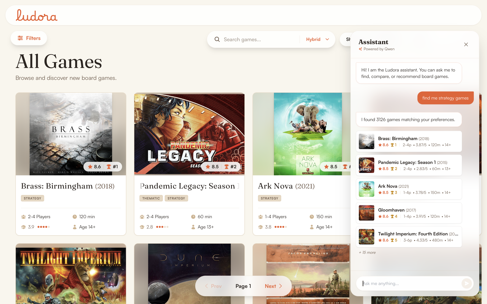
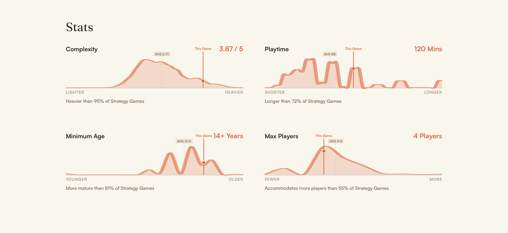

<p align="center"></p>

# Ludora

Ludora is a board-game discovery web app built on two merged Kaggle BoardGameGeek datasets (~28K games, ~26M ratings, ~4.2M reviews). It's a full-stack, ML-heavy portfolio project: hybrid search, a 10-algorithm recommendation engine you can compare side by side, aspect-based sentiment analysis over community reviews, and a conversational AI assistant — all built and documented with an explicit goal of not overclaiming what's actually implemented, tested, or measured.

**Start here:** [Case study](docs/case-study.md) (problem → architecture → data → ML → results, ~10 min read) · [Feature catalogue](docs/product/features.md) (every feature, with real screenshots) · [Known limitations](docs/limitations.md) (what's genuinely missing, stated plainly)

---

## What's actually in it

- **Catalog & discovery** — filterable (subdomain, category, BGG family, mechanic, players, complexity, playtime) and sortable grid of ~28K games, with custom SVG statistics (density distributions, rating histograms, recommendation gauges).
- **Hybrid search** — lexical (Postgres full-text), semantic ("vibe" search via `Qwen3-Embedding-0.6B` + pgvector), and a fused mode combining both with Reciprocal Rank Fusion.
- **Recommendation engine** — 10 model IDs across popularity, content-based (TF-IDF, metadata blend, semantic embedding, weighted hybrid), graph-based (Jaccard, DeepWalk), and collaborative filtering (Item-Item Cosine, SVD, ALS), with a UI to compare Coverage/diversity across all of them. **Not all 10 are fully wired end-to-end** — see [docs/ml/recommenders.md](docs/ml/recommenders.md) for exactly which.
- **Aspect-Based Sentiment Analysis** — a 17-aspect zero-shot classifier (`yangheng/deberta-v3-base-absa-v1.1`) extracts what reviewers actually said (Mechanics, Strategy, Theme, etc.), shown as per-aspect cards and, once generated, synthesized into an LLM-written "Community Consensus" paragraph per game.
- **AI Assistant** — a chat sidebar that parses natural language into a typed intent (browse/search/compare/recommend/get a game) via a locally-hosted LLM (Apple MLX, OpenAI-compatible), and renders results as inline cards, not free text.

Full breakdown of every feature, with screenshots: [docs/product/features.md](docs/product/features.md).

## What it deliberately doesn't claim

No user accounts or personalization (every visitor sees the same catalog). No multi-turn assistant memory (each message is parsed independently, despite an unused `conversation_id` field in the API). No automated test suite (every `test_*.py` file is a print-only smoke script). No persisted evaluation results (the metrics scripts exist and run correctly; none write their output to a file). Full, unabridged list: [docs/limitations.md](docs/limitations.md).

## Tech stack

**Backend**: Python 3.10+, FastAPI, SQLAlchemy, Alembic, PostgreSQL + pgvector, scikit-learn, `implicit`, sentence-transformers, HuggingFace Transformers, fastText.
**Frontend**: React 19, TypeScript (strict), Vite, TanStack Query, Tailwind CSS.
**AI/LLM**: Apple MLX (local inference), OpenAI-compatible client, structured JSON output validated against Pydantic schemas.
**Infra**: Docker Compose (Postgres + frontend + pgAdmin), backend runs natively (MLX requires macOS/Apple Silicon), 21 tracked Alembic migrations, 27 offline ETL/ML scripts.

## Why this is interesting beyond the feature list

- **Hybrid search** fuses Postgres full-text search and pgvector semantic search at request time with Reciprocal Rank Fusion (`k=60`) — not a toy demo, a real fused-ranking implementation.
- **The system is architecturally split in two**: an offline Python ETL/ML pipeline (~20 scripts) that populates Postgres, and a stateless FastAPI layer that mostly reads what the pipeline already computed. That split, and exactly where it breaks down, is documented in [docs/architecture/README.md](docs/architecture/README.md).
- **A real integration bug is documented, not hidden.** Digging into the recommendation engine's routing code during this documentation pass surfaced that 4 of the 10 model IDs currently serve identical results, despite genuinely distinct offline computation existing for three of them. That's disclosed with full detail in [docs/ml/recommenders.md](docs/ml/recommenders.md) rather than papered over — the kind of finding a careful code reviewer would want to know about either way.
- **Every quantitative claim is labeled by how it was obtained** — Measured (a committed result), Observed (a plausible-but-unverified number), or Not Evaluated — see [docs/ml/evaluation.md](docs/ml/evaluation.md).

## Screenshots

| Catalog | AI Assistant |
|---|---|
|  |  |

| Game detail hero | Recommendation model comparison |
|---|---|
|  |  |

| Statistics & distributions | Community Consensus (ABSA) |
|---|---|
|  |  |

More in [docs/product/features.md](docs/product/features.md), including the ratings histogram and user reviews screenshots.

## Getting started

```bash
docker compose up -d
```

This brings up Postgres, the frontend, and pgAdmin. **The backend runs natively, not in Docker** — `SearchService` uses `mlx-embeddings` (Qwen3-Embedding-0.6B) for semantic search, and MLX only runs on macOS/Apple Silicon (it's built on Metal), so a Linux container can never host it:

```bash
cd backend && uv sync && uv run uvicorn app.main:app --reload
```

- Frontend: http://localhost:5173
- API + Swagger docs: http://localhost:8000/docs
- Postgres: `localhost:5432`

This brings up an **empty** database — nothing here seeds it. To populate the catalog, run the data pipeline (raw CSVs → master dataset → Postgres → embeddings/search vectors): see [docs/setup/README.md](docs/setup/README.md) for exact commands, and [docs/architecture/data-pipeline.md](docs/architecture/data-pipeline.md) for what each of the 27 scripts does. The AI Assistant and "Community Consensus" generation additionally need a local MLX server (Apple Silicon only) — everything else works without it.

## Data

Two Kaggle datasets, merged on BGG ID: [threnjen/board-games-database-from-boardgamegeek](https://www.kaggle.com/datasets/threnjen/board-games-database-from-boardgamegeek/) (game metadata) and [jvanelteren/boardgamegeek-reviews](https://www.kaggle.com/datasets/jvanelteren/boardgamegeek-reviews/) (ratings + reviews). Not every file in either dataset is actually used by the pipeline — see [docs/data/README.md](docs/data/README.md) for exactly which CSVs feed which tables.

## Documentation map

| Doc | What it answers |
|---|---|
| [docs/case-study.md](docs/case-study.md) | The full problem → product → architecture → data → ML → results narrative |
| [docs/product/features.md](docs/product/features.md) | Every user-facing feature, with screenshots and code references |
| [docs/architecture/README.md](docs/architecture/README.md) | System design, service boundaries, request flows |
| [docs/architecture/data-pipeline.md](docs/architecture/data-pipeline.md) | The offline ETL/ML script order, script by script |
| [docs/data/README.md](docs/data/README.md) | Dataset provenance, schema, taxonomy, data quality rules |
| [docs/ml/README.md](docs/ml/README.md) | Search, recommenders, ABSA, and assistant — one doc per system |
| [docs/ml/evaluation.md](docs/ml/evaluation.md) | What's measured, what's observed-but-unverified, what isn't evaluated at all |
| [docs/engineering/testing.md](docs/engineering/testing.md) | The actual state of test coverage (no assertions, no CI) |
| [docs/setup/README.md](docs/setup/README.md) | Verified setup and environment-variable reference |
| [docs/roadmap.md](docs/roadmap.md) | Concretely evidenced planned/unfinished work |
| [docs/limitations.md](docs/limitations.md) | Every known gap, in one place |
| [AGENTS.md](AGENTS.md) | Navigation and invariants for anyone (human or AI) extending this repo |

## Status

Actively developed, local-first, not deployed anywhere public. Built end to end (schema through 21 migrations, 27 pipeline scripts, 19 API endpoints, and both frontends) over a short, concentrated build window rather than long-lived incremental development — see [docs/case-study.md](docs/case-study.md#tradeoffs-and-honest-caveats) for what that tradeoff means in practice.
