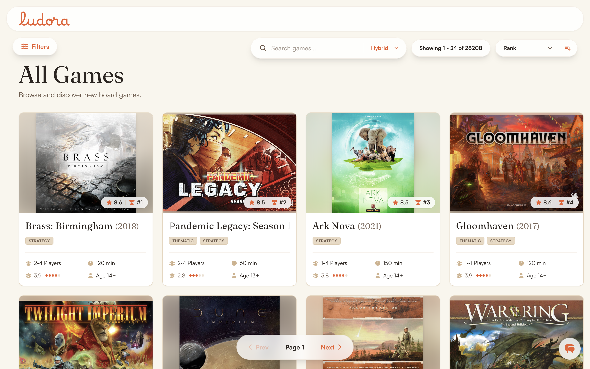
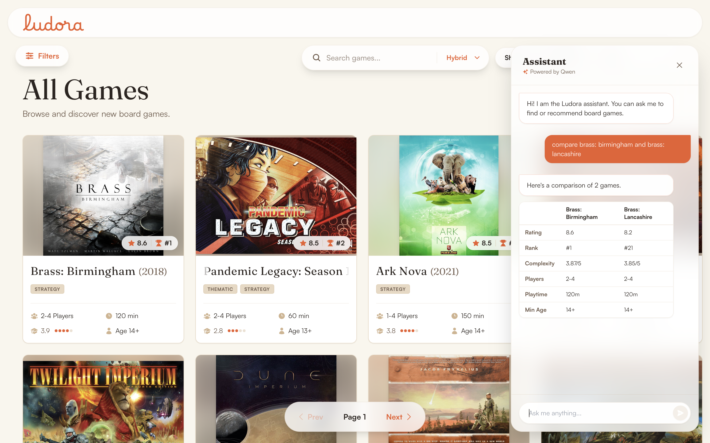
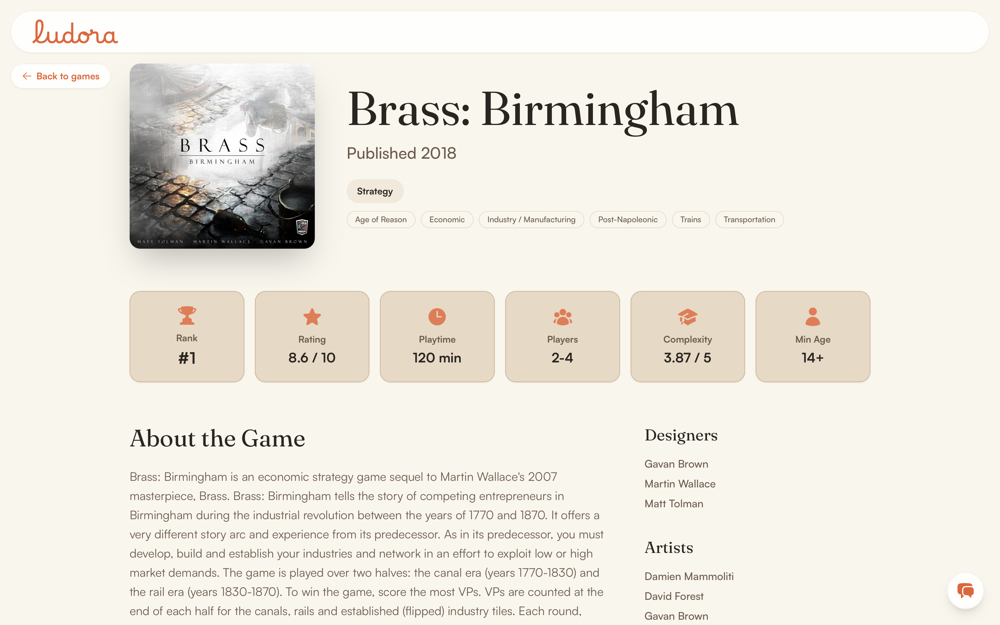
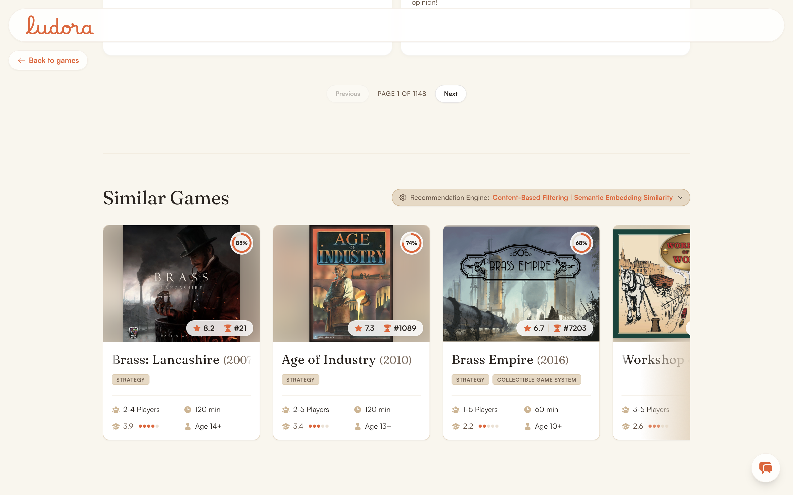
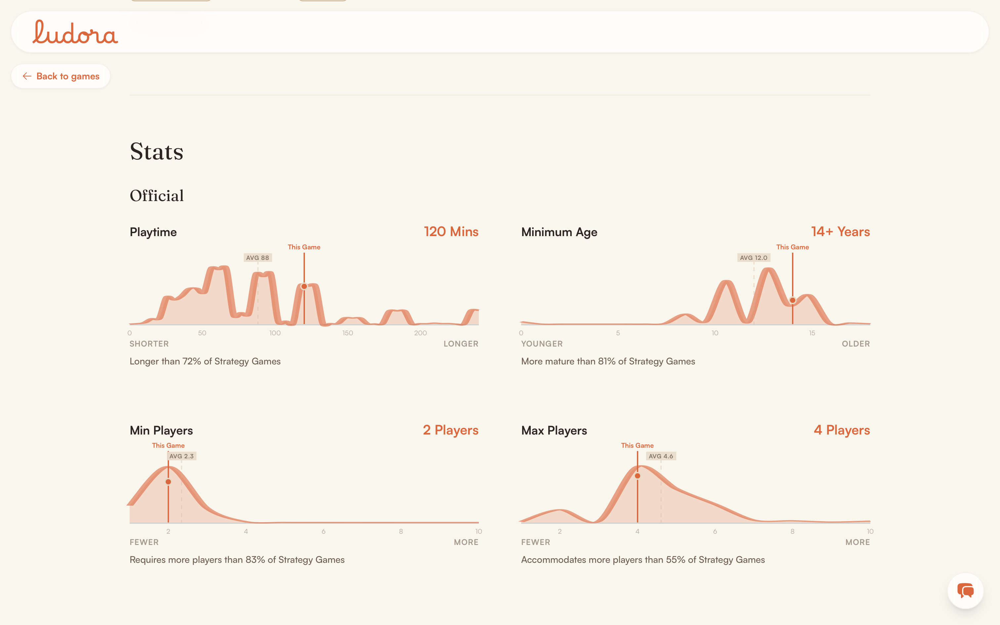
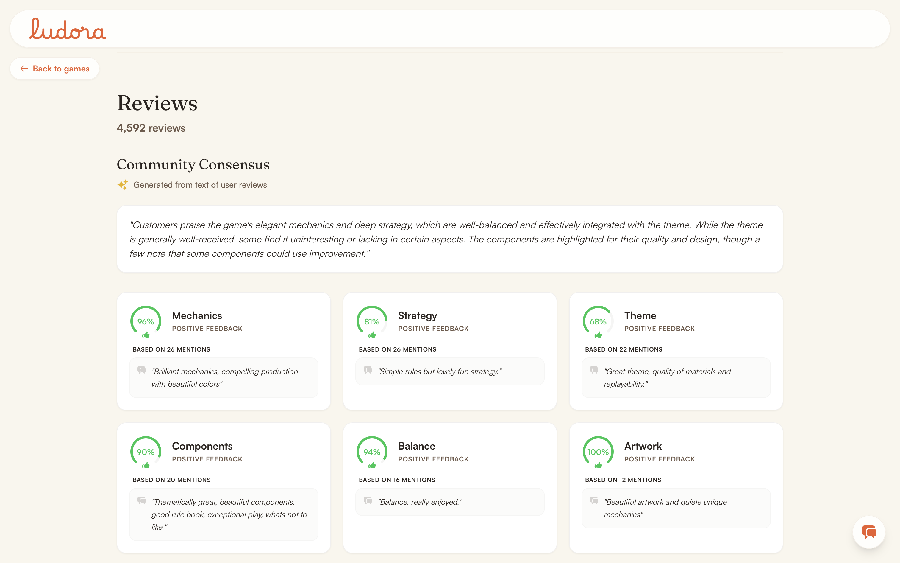

<p align="center"></p>

# Ludora

Ludora is a board game discovery app built on two merged [BoardGameGeek](https://boardgamegeek.com/) datasets from Kaggle: about 28,000 games, 26 million ratings, 4.2 million reviews. It's a full-stack, ML-heavy portfolio project. Hybrid search, a nine-algorithm recommendation engine you can compare side by side, aspect-based sentiment analysis over community reviews, and a conversational assistant that parses requests into typed intents instead of guessing at free text. Every claim in this repo is backed by something you can check yourself: a script you can rerun, an endpoint you can curl, a metric you can recompute.

**Start here:** [Case study](docs/case-study.md) (problem, architecture, data, ML, results, a 10 minute read), [feature catalogue](docs/product/features.md) (every feature, with screenshots), [known limitations](docs/limitations.md) (what's actually missing, stated plainly).

---

## What's in it

- **Catalog and discovery.** A filterable, sortable grid of ~28K games (subdomain, category, BGG family, mechanic, players, complexity, playtime), with hand-built SVG statistics: density distributions, rating histograms, recommendation gauges.
- **Hybrid search.** Lexical search through Postgres full-text, semantic "vibe" search through `Qwen3-Embedding-0.6B` and pgvector, and a fused mode combining both with Reciprocal Rank Fusion.
- **Recommendation engine.** Nine model IDs across four paradigms: popularity, content-based (TF-IDF, metadata blend, semantic embedding, graph Jaccard, DeepWalk), collaborative filtering (item-item cosine, ALS), and a live cross-paradigm hybrid blend. Compare coverage and diversity across all nine from the UI. See [docs/ml/recommenders.md](docs/ml/recommenders.md) for which models compute live and which read from a precomputed table.
- **Aspect-based sentiment analysis.** A 17-aspect zero-shot classifier (`yangheng/deberta-v3-base-absa-v1.1`) extracts what reviewers actually said about mechanics, strategy, theme, and more. Shown as per-aspect cards, plus an LLM-written "Community Consensus" paragraph once one's been generated for that game.
- **AI assistant.** A chat sidebar that parses natural language into a typed intent (browse, search, compare, recommend, look up one game) with a locally hosted LLM (Apple MLX, OpenAI-compatible), then renders the result as structured cards instead of a wall of text.

Full breakdown with screenshots: [docs/product/features.md](docs/product/features.md).

## What it doesn't do

No user accounts, so no personalization: every visitor sees the same catalog. Full list: [docs/limitations.md](docs/limitations.md).

## Stack

**Backend:** Python 3.10+, FastAPI, SQLAlchemy, Alembic, PostgreSQL with pgvector, scikit-learn, `implicit`, sentence-transformers, HuggingFace Transformers, fastText.

**Frontend:** React 19, TypeScript (strict), Vite, TanStack Query, Tailwind CSS.

**AI/LLM:** Apple MLX for local inference, an OpenAI-compatible client, structured JSON output validated against Pydantic schemas.

**Infra:** Docker Compose for Postgres, frontend, and pgAdmin. The backend runs natively since MLX needs macOS on Apple Silicon. 21 tracked Alembic migrations, 27 offline ETL/ML scripts.

## Under the hood

**Machine learning.** Four subsystems, each a different problem. Search fuses Postgres full-text and pgvector semantic retrieval with Reciprocal Rank Fusion (k=60) at request time. Reviews NLP runs a 17-aspect zero-shot ABSA classifier (DeBERTa) over free-text reviews, then an LLM synthesizes the per-aspect output into a "Community Consensus" paragraph. Recommendations span nine model IDs across four paradigms. The assistant parses a request into a typed Pydantic schema with a locally hosted LLM, then a deterministic orchestrator dispatches the parsed intent to the same services the rest of the app uses. Detail in [docs/ml/](docs/ml/).

**Frontend.** React 19 and strict TypeScript. The statistics section on the game detail page (density curves, percentile positioning, rating histograms, an arc gauge) is hand-rolled SVG with Catmull-Rom-style smoothing, not a charting library. See [docs/product/features.md#4-statistics--distribution-charts](docs/product/features.md#4-statistics--distribution-charts).

**Backend.** A layered FastAPI service where routes call services, services call the ORM or a recommender class, and nothing skips a layer. 18 REST endpoints. See [docs/architecture/README.md](docs/architecture/README.md).

**Database.** PostgreSQL with the pgvector extension for embedding search, a normalized schema with dedicated entity and join tables for every taxonomy type (subdomain, category, theme, family), and 21 tracked, reversible Alembic migrations. See [docs/data/README.md](docs/data/README.md).

## Screenshots

| Catalog | AI Assistant, comparing two games |
|---|---|
|  |  |

| Game detail hero | Recommendation engine results |
|---|---|
|  |  |

| Statistics & distributions | Community Consensus (ABSA) |
|---|---|
|  |  |

More in [docs/product/features.md](docs/product/features.md), including the ratings histogram, user reviews, and every AI assistant response type.

## Getting started

```bash
docker compose up -d
```

This brings up Postgres, the frontend, and pgAdmin. **The backend runs natively, not in Docker.** `SearchService` uses `mlx-embeddings` (Qwen3-Embedding-0.6B) for semantic search, and MLX is built on Metal, so it only runs on macOS with Apple Silicon:

```bash
cd backend && uv sync && uv run uvicorn app.main:app --reload
```

- Frontend: http://localhost:5173
- API + Swagger docs: http://localhost:8000/docs
- Postgres: `localhost:5432`

This brings up an **empty** database; nothing here seeds it. To populate the catalog, run the data pipeline (raw CSVs, then a master dataset, then Postgres, then embeddings and search vectors). See [docs/setup/README.md](docs/setup/README.md) for exact commands and [docs/architecture/data-pipeline.md](docs/architecture/data-pipeline.md) for what each of the 27 scripts does. The AI assistant and "Community Consensus" generation also need a local MLX server (Apple Silicon only); everything else works without it.

## Data

Two Kaggle datasets, merged on BGG ID: [threnjen/board-games-database-from-boardgamegeek](https://www.kaggle.com/datasets/threnjen/board-games-database-from-boardgamegeek/) for game metadata, and [jvanelteren/boardgamegeek-reviews](https://www.kaggle.com/datasets/jvanelteren/boardgamegeek-reviews/) for ratings and reviews. Not every file in either dataset ends up used by the pipeline; see [docs/data/README.md](docs/data/README.md) for exactly which CSVs feed which tables.

All of it traces back to [BoardGameGeek](https://boardgamegeek.com/) and its community: two decades of ratings, reviews, and game data contributed by people who love the hobby. This project is a personal proof of concept built to learn and to build the thing I wanted to build, not a commentary on BGG or a competitor to it, and it's not used for any commercial purpose. The data belongs to BoardGameGeek and the people who contributed it, not to this project.

## Documentation map

| Doc | What it answers |
|---|---|
| [docs/case-study.md](docs/case-study.md) | The full problem, product, architecture, data, ML, and results narrative |
| [docs/product/features.md](docs/product/features.md) | Every user-facing feature, with screenshots and code references |
| [docs/architecture/README.md](docs/architecture/README.md) | System design, service boundaries, request flows |
| [docs/architecture/data-pipeline.md](docs/architecture/data-pipeline.md) | The offline ETL/ML script order, script by script |
| [docs/data/README.md](docs/data/README.md) | Dataset provenance, schema, taxonomy, data quality rules |
| [docs/ml/README.md](docs/ml/README.md) | Search, recommenders, ABSA, and the assistant, one doc per system |
| [docs/ml/evaluation.md](docs/ml/evaluation.md) | What's measured, what's observed but unverified, what isn't evaluated at all |
| [docs/engineering/testing.md](docs/engineering/testing.md) | The actual state of test coverage: no assertions, no CI |
| [docs/setup/README.md](docs/setup/README.md) | Verified setup and environment variable reference |
| [docs/roadmap.md](docs/roadmap.md) | Concretely evidenced planned or unfinished work |
| [docs/limitations.md](docs/limitations.md) | Every known gap, in one place |
| [AGENTS.md](AGENTS.md) | Navigation and invariants for anyone, human or AI, extending this repo |

## Status

Actively developed, local-first, not deployed anywhere public. Built end to end (schema through 21 migrations, 27 pipeline scripts, 18 API endpoints, and both frontends) over a short, concentrated build window rather than long-lived incremental development.
