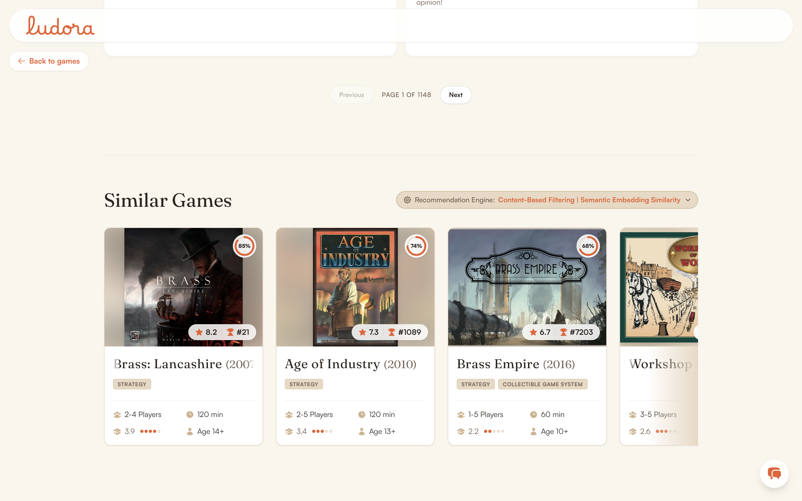
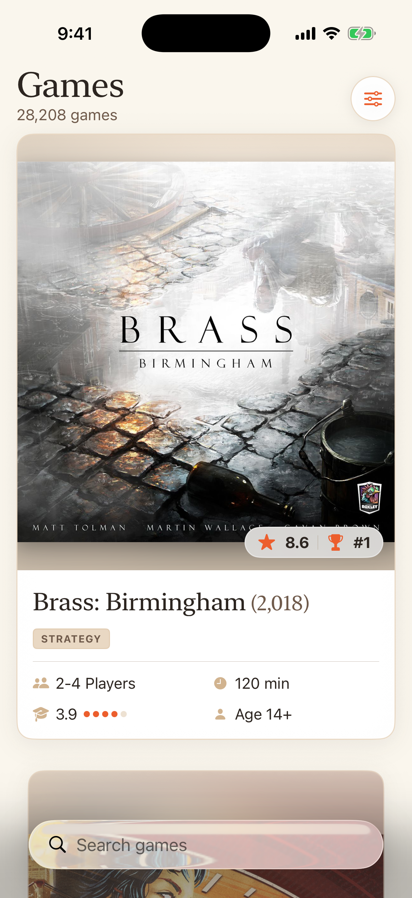
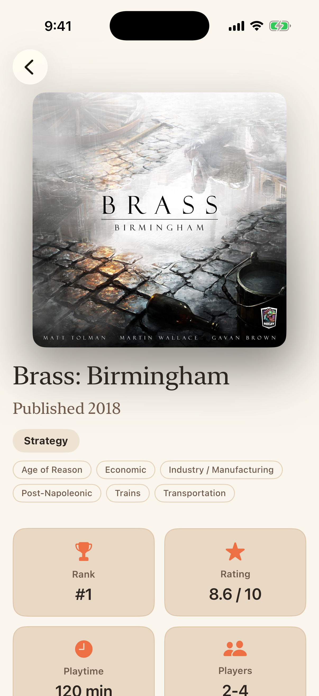
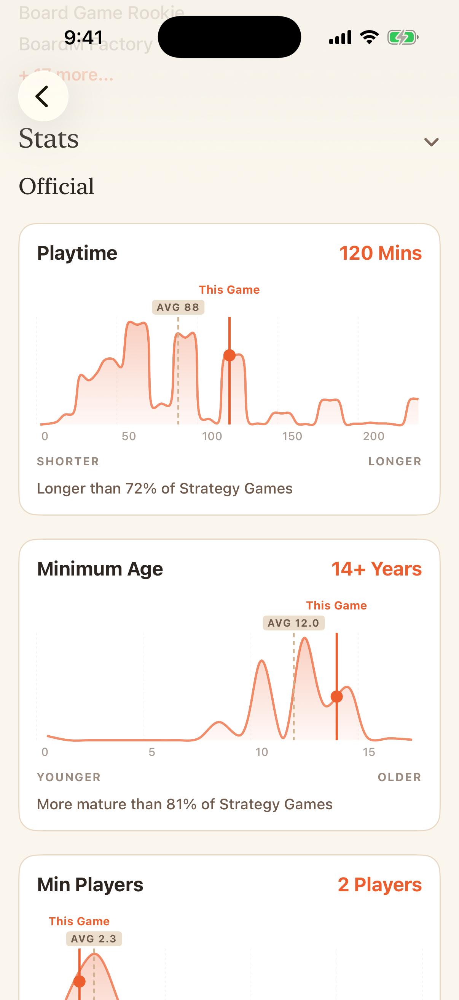

<p align="center"></p>

# Ludora

Ludora is a board game discovery app. It merges two [BoardGameGeek](https://boardgamegeek.com/) datasets from Kaggle: about 28,000 games, 26 million ratings, 4.2 million reviews.

It is a full-stack, ML-heavy system. It offers hybrid search, a nine-algorithm recommendation engine you can compare side by side, and aspect-based sentiment analysis over community reviews. A conversational assistant parses requests into typed intents instead of guessing at free text.

You can check every claim in this repo yourself: rerun a script, curl an endpoint, or recompute a metric.

**Start here:** [docs/](docs/README.md) is the map. The [web client](frontend/README.md) and [iOS client](ios/README.md) show every screen. Every doc ends with what that system does not do.

---

## What's in it

Four ML systems, then two clients that read them.

- **AI assistant**. A chat sidebar that parses natural language into a *typed plan* rather than guessing at free text. The intents are browse, search, compare, recommend, and look up one game. It runs on a locally hosted LLM (Apple MLX, OpenAI-compatible) and renders structured cards instead of a wall of text. [PydanticAI](https://ai.pydantic.dev/) checks the model's output against a schema and re-prompts it with the error when the shape is wrong. [LangGraph](https://langchain-ai.github.io/langgraph/) executes the plan, and can loosen an over-constrained request one filter at a time. Ask for "a quick, very heavy party game" and it tells you it relaxed the complexity limit rather than silently answering a different question. → [docs/ml/assistant.md](docs/ml/assistant.md)
- **Hybrid search**. Lexical through Postgres full-text, semantic "vibe" search through `Qwen3-Embedding-0.6B` and pgvector, and a fused mode combining both with Reciprocal Rank Fusion. All three modes are evaluated, and the results are committed. → [docs/ml/search.md](docs/ml/search.md)
- **Review NLP**. A 17-aspect zero-shot classifier (`yangheng/deberta-v3-base-absa-v1.1`) extracts what reviewers actually said about mechanics, strategy, theme, and more. A cheap model-free quality pipeline filters the 4.2M-review corpus down first. A local LLM then synthesizes the per-aspect output into a "Community Consensus" paragraph that cannot contradict the cards beneath it. → [docs/ml/absa.md](docs/ml/absa.md)
- **Recommendation engine**. Nine model IDs across four paradigms. Popularity, content-based (TF-IDF, metadata blend, semantic embedding, graph Jaccard, DeepWalk), collaborative filtering (item-item cosine, ALS), and a live cross-paradigm hybrid blend. Comparable side by side on the same game, from the UI. → [docs/ml/recommenders.md](docs/ml/recommenders.md)

Two clients read the same API:

- **Web** (React 19, TypeScript). A filterable grid over ~28K games, plus a game detail page whose statistics are hand-built SVG: density distributions, rating histograms, and an arc gauge. → [frontend/README.md](frontend/README.md)
- **iOS** (SwiftUI, no third-party dependencies). The same catalog and game detail, natively. → [ios/README.md](ios/README.md)

## What it doesn't do

No user accounts, so no personalization: every visitor sees the same catalog. It is a discovery and exploration tool, not a personalized app. Each doc's **Known limitations** section is the honest accounting for that system.

## Stack

**Backend:** Python 3.10+, FastAPI, SQLAlchemy, Alembic, PostgreSQL with pgvector, scikit-learn, `implicit`, sentence-transformers, HuggingFace Transformers, fastText.

**Frontend:** React 19, TypeScript (strict), Vite, TanStack Query, Tailwind CSS.

**iOS:** Swift 6 (strict concurrency), SwiftUI, iOS 17+, Swift Package Manager, no third-party dependencies.

**AI/LLM:** Apple MLX for local inference behind an OpenAI-compatible endpoint. PydanticAI for typed, self-repairing structured output. LangGraph for stateful plan execution.

**Infra:** Docker Compose for Postgres, frontend, and pgAdmin. The backend runs natively since MLX needs macOS on Apple Silicon. 27 tracked Alembic migrations, 21 offline ETL/ML scripts.

## How it's built

**Frontend**. React 19 and strict TypeScript. The statistics section on the game detail page is hand-rolled SVG with Catmull-Rom-style smoothing, not a charting library. It covers density curves, percentile positioning, rating histograms, and an arc gauge. See [frontend/README.md](frontend/README.md#distribution-charts).

**iOS**. A native SwiftUI client. The models, the API client, and the values derived from them live in a `LudoraKit` Swift package that imports only Foundation. Its tests therefore run from the command line, with no Xcode project and no simulator. View code stays in the app target. See [ios/AGENTS.md](ios/AGENTS.md).

**Backend**. A layered FastAPI service where routes call services, services call the ORM or a recommender class, and nothing skips a layer. 19 REST endpoints. See [docs/architecture/README.md](docs/architecture/README.md).

**Database**. PostgreSQL with the pgvector extension for embedding search. The schema is normalized, with dedicated entity and join tables for every taxonomy type: subdomain, category, theme, family. It has 27 tracked, reversible Alembic migrations. See [docs/data/README.md](docs/data/README.md).

## Screenshots

| Catalog | AI Assistant, comparing two games |
|---|---|
|  |  |

| Game detail hero | Recommendation engine results |
|---|---|
|  |  |

| Statistics & distributions | Community Consensus (ABSA) |
|---|---|
|  |  |

| iOS: browse | iOS: game detail | iOS: statistics |
|---|---|---|
|  |  |  |

More in the [web client](frontend/README.md) and [iOS client](ios/README.md) READMEs, including the ratings histogram, user reviews, and every AI assistant response type.

## Getting started

```bash
docker compose up -d                                            # Postgres, frontend, pgAdmin
cd backend && uv sync && uv run uvicorn app.main:app --reload   # the backend runs natively
```

Then open http://localhost:5173. The backend stays out of Docker because MLX has no Linux build, explained in [docs/architecture/README.md](docs/architecture/README.md#why-the-backend-is-not-a-compose-service).

**This brings up an empty database.** Nothing seeds it. [docs/setup/README.md](docs/setup/README.md) has everything needed to populate it.

The iOS client is a separate Xcode project. `make ios-test` runs its package tests with no Xcode and no simulator: [ios/README.md](ios/README.md).

## Data

Two Kaggle datasets, merged on BGG ID: [threnjen/board-games-database-from-boardgamegeek](https://www.kaggle.com/datasets/threnjen/board-games-database-from-boardgamegeek/) for game metadata, and [jvanelteren/boardgamegeek-reviews](https://www.kaggle.com/datasets/jvanelteren/boardgamegeek-reviews/) for ratings and reviews. The pipeline does not use every file in either dataset. See [docs/data/README.md](docs/data/README.md) for exactly which CSVs feed which tables.

All of it traces back to [BoardGameGeek](https://boardgamegeek.com/) and its community: two decades of ratings, reviews, and game data contributed by people who love the hobby.

Ludora is not a commentary on BGG, not a competitor to it, and not used for any commercial purpose. The data belongs to BoardGameGeek and the people who contributed it, not to this project.

## Documentation

[docs/](docs/README.md) is the map: four ML systems, the two clients, how it is built, and how to run it. [AGENTS.md](AGENTS.md) holds the conventions and invariants for extending the repo.

Every doc explains *why*, not what the code does, and ends with its own **Known limitations**.

## Status

Actively developed and local-first: 27 migrations, 21 pipeline scripts, 19 API endpoints, a React web app, and a native iOS client.
