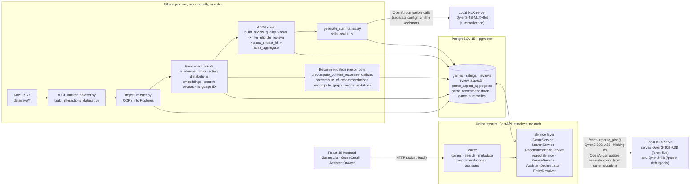

# Architecture

Ludora is two systems joined by PostgreSQL: an **offline Python pipeline** (27 scripts) that turns raw CSVs into populated tables and precomputed recommendation/ABSA rows, and a **stateless FastAPI service** that reads those tables at request time. Almost nothing is computed live except lexical/semantic search and three of the nine recommendation model IDs: `popularity`, `embedding`, and `hybrid` (see [Recommendation routing](#recommendation-routing-live-vs-precomputed) below).

For the step-by-step data pipeline (what runs in what order, what each script reads/writes), see [data-pipeline.md](data-pipeline.md). For dataset provenance and schema, see [docs/data/README.md](../data/README.md).

## System diagram

## Layered backend design

The backend follows a **routes → services → (ORM models / recommenders)** layering. Route handlers never touch SQLAlchemy directly; each instantiates a service class and returns its result through a Pydantic `response_model`. Every route except `/health` carries an explicit OpenAPI `summary` and `description`.

Every request is logged (method, path, status, duration) via a `structlog`-based middleware in `backend/app/main.py`, console-rendered for local reading, not shipped anywhere. `AssistantService`'s two LLM-calling methods log the same way per attempt (model, duration, outcome). See `backend/app/core/logging_config.py`.

### API surface: 18 endpoints across 6 files

| File → mount | Endpoints |
|---|---|
| `backend/app/main.py` | `GET /health` |
| `backend/app/api/routes/games.py` → `/api/games` | `GET /`, `GET /{bgg_id}`, `GET /{bgg_id}/reviews`, `GET /{game_id}/aspects` |
| `backend/app/api/routes/search.py` → `/api/search` | `POST /` |
| `backend/app/api/routes/metadata.py` → `/api` | `GET /subdomains`, `/categories`, `/themes`, `/families`, `/mechanics`, `/designers`, `/publishers`, `/artists` |
| `backend/app/api/routes/recommendations.py` → `/api` | `GET /recommendation-models`, `GET /games/{game_id}/recommendations` |
| `backend/app/api/routes/assistant.py` → `/api/assistant` | `POST /parse`, `POST /chat` |

Full request/response shapes are in the live Swagger UI (`http://localhost:8000/docs` once running); this doc does not duplicate the OpenAPI spec. There used to be a dedicated `POST /api/games/compare` route; it's gone now that comparison lives entirely in the assistant's `compare` intent, which builds its table from the same `GameService.get_game()` calls a single lookup would make.

**One real frontend/backend consistency gap**: `GET /api/games/{id}/aspects` is called from `GameDetail.tsx` with an inline `axios` call rather than through the shared `frontend/src/api/games.ts` client that every other endpoint goes through. Not a functional bug, just a spot the client abstraction doesn't cover yet.

### Service layer

| Service (`backend/app/services/`) | Responsibility | Called by |
|---|---|---|
| `GameService` | Catalog list and detail | `routes/games.py`, `AssistantOrchestrator` |
| `SearchService` | Lexical, semantic, hybrid (RRF) search, plus shared filter logic | `routes/search.py`, `AssistantOrchestrator`, `EntityResolver` |
| `RecommendationService` | Routes 9 model IDs across 4 paradigms: `popularity` and `embedding` to a live query, `hybrid` to a live cross-paradigm blend, the remaining 6 to a precomputed-table read | `routes/recommendations.py`, `AssistantOrchestrator` |
| `ReviewService` | Paginated review browsing, language and rating filters | `routes/games.py`, `AssistantOrchestrator` |
| `AspectService` | ABSA aggregate lookup per game | `routes/games.py`, `AssistantOrchestrator` |
| `MetadataService` | Subdomain, category, theme, family, mechanic, designer, publisher, and artist lookups | `routes/metadata.py` |
| `AssistantService` | Drives the local LLM through PydanticAI agents; returns a validated `ParsedIntent`/`ParsedPlan`, retrying with the validation error attached when the model gets the shape wrong | `routes/assistant.py` |
| `AssistantOrchestrator` | Dispatches a parsed intent to whichever service handles it; multi-step plans are compiled (`plan_graph`), resolved (`plan_resolution`), and walked by a LangGraph state machine (`plan_executor`) | `routes/assistant.py` |
| `EntityResolver` | Resolves fuzzy game, category, theme, and mechanic names via `SearchService` lexical search plus class-level caches | `AssistantOrchestrator` |
| `SummarizationService` | Builds the "Community Consensus" paragraph from ABSA aggregates via the local LLM | Offline only, `scripts/generate_summaries.py`; no live route calls it |

Full detail on the ML-relevant services (`SearchService`, `RecommendationService`, `AssistantService`/`AssistantOrchestrator`, `SummarizationService`) is in [docs/ml/](../ml/README.md), not repeated here.

## Request flows

**Browse.** `GamesList.tsx` calls `GET /api/games` (filters: subdomains, categories, families, mechanics, exact players, min/max players, min/max weight, min/max playtime; sort: rank, rating, year, complexity, name), which calls `GameService.get_games()`, which runs SQLAlchemy with `selectin` eager loading for relationships, and returns `PaginatedGames` to a `GameCard` grid.

**Search.** The search bar posts to `POST /api/search` with a `mode` of `lexical`, `semantic`, or `hybrid`, which calls `SearchService.search()`. Lexical and semantic candidate sets (100 each) are fused with Reciprocal Rank Fusion (`k=60`), then `apply_game_filters()` runs on the fused set, then results are paginated. See [docs/ml/search.md](../ml/search.md) for the exact formula.

**Game detail.** `GameDetail.tsx` mounts and independently fires `GET /api/games/{id}` (detail plus a manually-attached `GameSummary`), `GET /api/games/{id}/recommendations?model=hybrid` (default model), `GET /api/games/{id}/reviews` (paginated, 4 per page), and `GET /api/games/{id}/aspects`. These are four independent requests, not one aggregated payload.

**AI Assistant.** `AssistantDrawer.tsx` posts to `POST /api/assistant/chat`. `AssistantService.parse_plan()` sends the message plus the `ParsedPlan` JSON schema to the local LLM (Qwen3-30B-A3B, up to 2 retries on a malformed or empty completion), returning one or more dependent steps rather than a single intent. `AssistantOrchestrator.execute_plan()` compiles the plan into a validated dependency graph (`plan_graph.compile_plan()`), then walks it in order, substituting any earlier step's result into a later step's placeholder before calling whichever of `GameService`, `SearchService`, `RecommendationService`, `AspectService`, `ReviewService`, or `EntityResolver` that step needs, and returns an `AssistantResponse` rendered by `AssistantMessageBubble`. See [docs/ml/assistant.md](../ml/assistant.md) for intent coverage, the multi-step mechanism, and known gaps.

**Offline pipeline.** See [data-pipeline.md](data-pipeline.md) for the full script-by-script trace and run order.

## Recommendation routing: live vs. precomputed

`RecommendationService.get_recommendations()` routes each of the 9 model IDs across 4 paradigms. `popularity` runs a live rank query. `embedding` runs a live pgvector `cosine_distance` query, filtered to the currently-configured model. `hybrid` is computed live as a 0.5/0.5 blend of `cf_item_cosine`'s and `metadata`'s normalized precomputed scores, and is never written to `game_recommendations`. The remaining 6 model IDs (`metadata`, `tfidf`, `graph_jaccard`, `deepwalk`, `cf_item_cosine`, `cf_als`) read directly from the precomputed `game_recommendations` table. Full detail is in [docs/ml/recommenders.md](../ml/recommenders.md).

## Configuration and security posture

The app has no authentication layer: no login, no session, no auth dependency on any route. CORS is wide open (`allow_origins=["*"]`, `backend/app/main.py`, commented `# For development`). The only configured setting, `DATABASE_URL` (`backend/app/core/config.py`), has a hardcoded local-development default credential. Fine for a portfolio project run locally, and it would need to change before any public deployment. Full detail in [docs/limitations.md](../limitations.md); no credential values are reproduced in any doc.

## Local orchestration

`docker-compose.yml` defines three services: `db` (`pgvector/pgvector:pg15`, port 5432, `pg_isready` healthcheck), `frontend` (built from `frontend/Dockerfile`, port 5173, Vite dev server), and `pgadmin` (`dpage/pgadmin4`, port 5050, a database-inspection UI with no bearing on the app itself). The frontend reaches the backend via an absolute `VITE_API_URL`, not a dev-server proxy.

**The backend is deliberately not a Compose service.** `SearchService` depends on `mlx-embeddings` for semantic search (`Qwen3-Embedding-0.6B`), and MLX is built on Apple's Metal and Accelerate frameworks. It has no Linux implementation, so no container built on a Linux base image can run it. The backend runs natively instead: `cd backend && uv run uvicorn app.main:app --reload`. See [docs/setup/README.md](../setup/README.md) for verified run commands.
