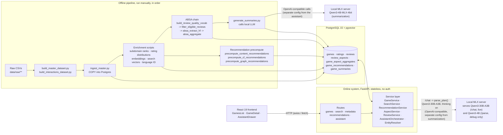

# Architecture

Ludora is two systems joined by PostgreSQL. An **offline Python pipeline** (21 scripts) turns raw CSVs into populated tables and precomputed recommendation/ABSA rows. A **stateless FastAPI service** reads those tables at request time. Almost nothing is computed live except lexical/semantic search and three of the nine recommendation model IDs: `popularity`, `embedding`, and `hybrid` (see [Recommendation routing](#recommendation-routing-live-vs-precomputed) below).

For the step-by-step data pipeline (what runs in what order, what each script reads/writes), see [data-pipeline.md](data-pipeline.md). For dataset provenance and schema, see [docs/data/README.md](../data/README.md).

## System diagram

```mermaid
flowchart LR
    subgraph Offline["Offline pipeline, run manually, in order"]
        RAW["Raw CSVs\ndata/raw/**"] --> MERGE["build_master_dataset.py\nbuild_interactions_dataset.py"]
        MERGE --> INGEST["ingest_master.py\nCOPY into Postgres"]
        INGEST --> ENRICH["Enrichment scripts\nsubdomain ranks · rating distributions\nembeddings · search vectors · language ID"]
        ENRICH --> ABSA["ABSA chain\nbuild_review_quality_vocab -> filter_eligible_reviews\n-> absa_extract_hf -> absa_aggregate"]
        ENRICH --> RECS["Recommendation precompute\nprecompute_content_recommendations\nprecompute_cf_recommendations\nprecompute_graph_recommendations"]
        ABSA --> SUMM["generate_summaries.py\ncalls local LLM"]
    end

    SUMM -- "OpenAI-compatible calls\n(separate config from the assistant)" --> MLX2["Local MLX server\nQwen3-4B-MLX-4bit\n(summarization)"]

    subgraph DB["PostgreSQL 15 + pgvector"]
        TBLS[("games · ratings · reviews\nreview_aspects · game_aspect_aggregates\ngame_recommendations · game_summaries")]
    end

    INGEST --> TBLS
    ENRICH --> TBLS
    ABSA --> TBLS
    RECS --> TBLS
    SUMM --> TBLS

    subgraph Online["Online system, FastAPI, stateless, no auth"]
        API["Routes\ngames · search · metadata\nrecommendations · assistant"]
        SVC["Service layer\nGameService · SearchService · RecommendationService\nAspectService · ReviewService · AssistantOrchestrator · EntityResolver"]
        API --> SVC
    end

    TBLS <--> SVC
    SVC -- "/chat -> parse_plan()\nQwen3-30B-A3B, thinking on\n(OpenAI-compatible, separate config from summarization)" --> MLX["Local MLX server\nserves Qwen3-30B-A3B (/chat, live)\nand Qwen3-4B (/parse, debug only)"]

    FE["React 19 frontend\nGamesList · GameDetail · AssistantDrawer"] -- "HTTP (axios / fetch)" --> API
```

## Layered backend design

**routes → services → (ORM models / recommenders)**, and nothing skips a layer. Route handlers never touch SQLAlchemy directly: each instantiates a service and returns its result through a Pydantic `response_model`. Every route except `/health` carries an explicit OpenAPI summary.

19 endpoints across 6 route files. Shapes are in the live Swagger UI at `/docs`, which this doc does not duplicate.

A `structlog` middleware logs every request (method, path, status, duration), console-rendered for local reading and shipped nowhere. `AssistantService`'s two LLM-calling methods log per attempt (model, duration, outcome).

**One real frontend/backend consistency gap**: `GET /api/games/{id}/aspects` is called from `GameDetail.tsx` with an inline `axios` call rather than the shared `frontend/src/api/games.ts` client every other endpoint uses. Not a functional bug, just a spot the client abstraction does not cover.

### Services, and who calls them

| Service | Responsibility | Called by |
|---|---|---|
| `GameService` | Catalog list and detail | `routes/games.py`, `AssistantOrchestrator` |
| `SearchService` | Lexical, semantic, hybrid search, plus the shared filter logic | `routes/search.py`, `AssistantOrchestrator`, `EntityResolver` |
| `RecommendationService` | Routes the 9 model IDs, live or precomputed | `routes/recommendations.py`, `AssistantOrchestrator` |
| `ReviewService` | Paginated review browsing with language and rating filters | `routes/games.py`, `AssistantOrchestrator` |
| `AspectService` | ABSA aggregate lookup per game | `routes/games.py`, `AssistantOrchestrator` |
| `MetadataService` | Taxonomy lookups for the filter sidebar | `routes/metadata.py` |
| `AssistantService` | Drives the LLM through PydanticAI, returns a checked plan | `routes/assistant.py` |
| `AssistantOrchestrator` | Dispatches each step, walks multi-step plans | `routes/assistant.py` |
| `EntityResolver` | Resolves names via lexical search plus class-level caches | `AssistantOrchestrator` |
| `SummarizationService` | Builds the Community Consensus paragraph | Offline only. No live route calls it |

**The assistant reuses these same services.** It has no separate data path. A fix in `GameService` therefore shows up in both the catalog and the chat drawer.

The four ML-heavy services are documented in [docs/ml/](../ml/), not here.

## Request flows

**Browse**. `GamesList.tsx` → `GET /api/games` → `GameService.get_games()`, SQLAlchemy with `selectin` eager loading, returning `PaginatedGames`.

**Game detail**. `GameDetail.tsx` fires **four independent requests** on mount: detail, recommendations, reviews, and aspects. Not one aggregated payload.

**Search** and **AI Assistant** flows are in [search.md](../ml/search.md) and [assistant.md](../ml/assistant.md). **Offline pipeline**: [data-pipeline.md](data-pipeline.md).

## Recommendation routing: live vs. precomputed

Three of the nine model IDs compute at request time and are never stored: `popularity` (a rank query), `embedding` (a pgvector query), and `hybrid` (a live blend). The other six read precomputed rows. The full table is in [recommenders.md](../ml/recommenders.md).

## Configuration and security posture

No authentication on any route, CORS wide open, and a hardcoded local-development default for `DATABASE_URL`. That suits local use, and all of it must change before any public deployment. Detail: [setup/README.md](../setup/README.md#security-posture-local-only). No credential values appear in any doc.

## Why the backend is not a Compose service

`docker-compose.yml` runs Postgres, the frontend, and pgAdmin. The backend is deliberately left out.

`SearchService` depends on `mlx-embeddings` for semantic search, and MLX is built on Apple's Metal and Accelerate frameworks. It has no Linux implementation, so no container on a Linux base image can run it. The backend runs natively instead. Commands: [setup/README.md](../setup/README.md).
