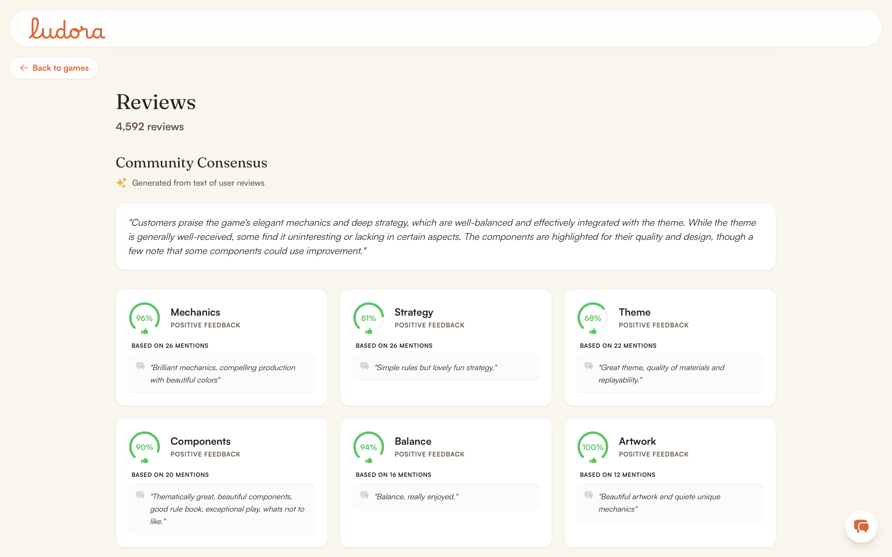

# Aspect-based sentiment analysis, and the Community Consensus paragraph

**Status: implemented as an offline batch pipeline. Eligibility is computed over the full ~4.2M-review corpus. Classification is running in resumable chunks and has attempted 39,484 of 267,950 eligible reviews**.

## Problem

A star rating does not say *why* someone liked a game. Extract per-aspect sentiment from free text, so "the rulebook was confusing" becomes `Rulebook: negative`.

Two independent systems feed that one section. The cards come from the classifier below. The paragraph above them comes from a separate offline LLM pass. They are gated separately on purpose: a game can show cards with no paragraph, but never the reverse.

## Taxonomy: 17 aspects, cut from 22

Mechanics, Strategy, Theme, Replayability, Components, Artwork, Rulebook, Setup, Learning Curve, Complexity, Downtime, Player Interaction, Balance, Luck, Solo Play, Game Length, Value.

Five were dropped, each against real mention counts rather than judgment alone:

- **Gameplay**, too broad. It added nothing beyond Mechanics, Strategy, Balance, and Player Interaction combined.
- **Immersion**, 6 mentions against Theme's 294. Reviewers do not separate "good theme" from "felt immersed".
- **Production Quality**, a vaguer umbrella over the more specific Components and Artwork.
- **Teardown**, 2 mentions in the entire eligible corpus, against Setup's 50.
- **Player Count**, the wrong shape for one sentiment score. "Great at 2, drags at 5" is not one verdict, and the structured `suggested_num_players` poll already answers it elsewhere on the page.

Aspect count is also a real performance lever, roughly linear down to about 11 aspects. The cut was still decided on whether each aspect helps a reader, not on speed.

## Why a discriminative classifier, not a prompted LLM

An earlier pipeline asked a local Ollama `qwen2.5:7b` for `positive|negative|mixed|neutral` per aspect as JSON, reading from a CSV pilot filter. It was removed entirely.

The current path pairs each review with each of the 17 aspect strings as sentence-pair input to `yangheng/deberta-v3-base-absa-v1.1`. All 17 go in one forward pass, 3-way output per pair. A discriminative classifier is faster and more consistent than prompting a generative model per item. The label set here is fixed, which is exactly that case.

The **base** checkpoint, not the larger one. Both share a trainer and the same ~180K-example corpus (SemEval-2014/2016, MAMS), so checkpoint size does not change the domain mismatch discussed under Evaluation. It only changes speed.

Evidence sentences are **not** model-selected. They are a regex fallback returning the first sentence containing the literal aspect word.

### Batching, measured

| Configuration | Throughput |
|---|---|
| `batch_size=11`, tuned for the larger checkpoint | 9.66 reviews/sec |
| All 17 aspects in one pass | **12.04 reviews/sec** |
| Padding batches wider (44, 88) | no further gain |
| Batching across different reviews, 16 per batch | projected 10.18h to 58.14h |

Cross-review batching fails because `padding=True` pads every sequence to the longest in the batch. Mixing review lengths therefore burns compute, padding short reviews out to match long ones. Once every aspect is in one pass there is nothing left to batch.

### Investigated and ruled out

- **ONNX quantization via `optimum`**. Blocked by a hard dependency conflict: `optimum` requires `transformers<4.58`, and this project is on `transformers>=5.15` for the Qwen3-Embedding work.
- **A smaller DistilBERT ABSA checkpoint** (`lhoestq/distilbert-base-uncased-finetuned-absa-as`). Its model card does not say whether it generalizes to arbitrary custom aspects, which is the zero-shot property this whole pipeline depends on. It may be locked to its own training aspect set. Settling that needs real testing, not a doc read.

## Quality and eligibility filtering

`app.core.review_quality` is deliberately cheap and model-free, so it can run over the whole corpus rather than a pre-restricted sample. Four stages:

1. **Language gate**, reusing `reviews.language`/`language_confidence` that `scripts/detect_languages.py` already computed with fastText, rather than calling fastText per review.
2. **Hard filters**: minimum chars and tokens, valid Unicode, at least one letter, and detectable sentiment via NLTK's VADER lexicon.
3. **Dedup**: exact normalized-text hash, plus 64-bit SimHash bucketed by fingerprint prefix. Comparing every candidate against every prior fingerprint is O(n²) and intractable at this scale. Bucketing bounds each comparison, at the cost of occasionally missing a near-dup whose difference falls in those bits.
4. **Weighted score** over information density, lexical diversity, corpus-derived domain specificity, and a boilerplate-phrase penalty. Threshold 0.6, calibrated against a real 50K-review score distribution where p90 sat around 0.6, not guessed.

**Why VADER is in there**. A large fraction of what the earlier heuristics passed was not opinion at all. It was BGG collection and trade-log notes, and metadata dumps like "Received 04/08/2023" or "Weight: 2.67 / 5 Includes Collectors box". Density and stopword ratio cannot separate those from a genuine short opinion, because "Cool little drafting game" also has zero stopwords.

**Tried and reverted:** a stopword-ratio hard filter, dropped after it wrongly flagged genuine short reviews.

## Storing the full record, not just the winner

`review_aspects` holds every winning prediction plus the complete 3-class softmax, at any confidence, for all three labels.

That makes every confidence and sentiment decision a **query-time** decision. `WINNER_PROB_THRESHOLD` (0.7) is enforced in aggregation, not extraction, so it can be retuned without re-running the multi-hour classification pass. The probabilities are technically recoverable from `(sentiment, confidence, sentiment_score)` by algebra, but storing them explicitly avoids depending on a future reader rediscovering that.

0.7 came from a 400-review probe with 126 evidence-matched pairs. Median winner confidence was 0.991 positive, 0.968 negative, and only 0.843 neutral. A naive 0.5 bar filters almost nothing, since every stored positive and negative prediction already clears it. At 0.7, 81.7% of that sample's positive and negative evidence survives. At 0.9, 71.4%. A starting point, not a final calibration, and worth revisiting once more of the corpus is classified.

## Resumability, and the bug that forced it

`absa_extract_hf.py` reads `is_absa_eligible` directly, no cache and no cap, in `quality_score` descending order, so an interrupted run leaves the **best** reviews done rather than an arbitrary prefix. `--minutes N` stops cleanly on a wall-clock budget, and every review's outcome commits immediately, so interrupting is always safe.

Resume is tracked on `reviews.absa_processed_at`, set on every review the script runs inference on, **regardless of whether that review produced any row**. That distinction is the whole point. A review that classifies but yields zero evidence-matched aspects never produces a `review_aspects` row. Tracking "was this attempted" separately from "did it produce a row" is what makes resume work, rather than silently re-classifying an ever-growing backlog.

## Aggregation and card states

`absa_aggregate.py` rolls rows into `game_aspect_aggregates` with one `INSERT ... SELECT ... GROUP BY ... ON CONFLICT DO UPDATE`, restricted to rows clearing `WINNER_PROB_THRESHOLD`. `mixed_count` is always 0, because `sentiment` is never `'mixed'` anywhere in this pipeline.

A card claims **Positive** or **Negative** only when that share of mentions clears 60% (`CARD_DOMINANCE_THRESHOLD`). Otherwise it shows **Mixed** rather than a coin-flip plurality winner, so 45/10/45 reads as Mixed and not "Positive by a hair".

Crossing 60% mathematically guarantees that bucket is also the largest of the three. The shown percentage and quote therefore always come from the biggest bucket. "Confident label" and "largest bucket" diverge only in the Mixed case, where there is no confident label anyway. Confident cards show up to 3 quotes from the dominant side. Mixed cards show one positive and one negative, so the split is legible rather than asserted.

This rule lives in both `AspectService.get_game_aspects()` and `GameDetail.tsx`, and has to stay in sync, because Python and TypeScript cannot share the implementation.

## Downstream: the Community Consensus paragraph

**Status: implemented, still one game at a time**. `SummarizationService` is called only by `scripts/generate_summaries.py`, never by a live route.

A game needs at least 15 reviews with usable ABSA signal, counted as **distinct confidence-filtered `review_id`s**, not `review_aspects` rows, which overstate it. Brass: Birmingham measured 175 rows from only 112 distinct reviews.

Then: top 5 aspects by mentions, with up to 100 evidence rows each, sampled proportionally by sentiment. One LLM call per aspect gives a one-sentence mini-summary. A final call synthesizes a 2-to-3 sentence paragraph. Both schemas are Pydantic-checked. The prompt forbids inventing information and forbids absolute claims.

**The paragraph cannot contradict the cards**. Each aspect's verdict is computed with the same `CARD_DOMINANCE_THRESHOLD` rule the cards use. It is passed into the prompt as ground truth, and then **overwrites** whatever sentiment the LLM returned. Evidence sampling applies the identical confidence filter aggregation uses, so the LLM sees exactly what is being counted, not a superset. Checked against Brass's real data: 26/26, 22/22, 20/20, 16/16 evidence against `total_mentions`, no discrepancy.

Sampling uses a seeded `random.Random`, so the same aspect draws the same evidence and the same LLM input across runs.

### A measured failure, and its fix

Larger prompts intermittently returned an **empty completion** that failed schema validation. One case: 46 evidence lines for Ark Nova's Theme aspect, `finish_reason=stop`, well under `MAX_TOKENS`, at about **30s** latency against 1-3s for successful calls. The same aspect with fewer evidence lines succeeded.

That latency gap points at the model spending its generation budget on hidden reasoning tokens and never reaching the JSON.

Both prompts now carry Qwen3's `/no_think` directive. The previously-failing case then ran **3 for 3** at 0.9-2.7s and about 57 completion tokens. The full pipeline took all 5 of Ark Nova's aspects on first attempt, at 1.4-2.8s each. `_call_llm_json` also retries twice on a validation failure. One unresolvable aspect is skipped and the game still generates. A failed final synthesis skips the game rather than leaving it half-written.

**Summarization's LLM config is fully separate from the assistant's**, not just a different model name. Summarization is an offline precompute job and the assistant serves live requests. The two should never have to agree on a server instance, even though both currently default to `Qwen/Qwen3-4B-MLX-4bit`.

## Measured

- **Eligibility:** 267,950 of 4,208,067 reviews eligible, about 6.4%, in 835.6 seconds.
- **Classification:** 39,484 attempted, 13,739 yielding at least one storable aspect, across 4,463 distinct games. Throughput has held at **20-24 reviews/sec** across many chunked sessions and a range of games, projecting roughly 3 to 3.5 more hours.
- **Spot-checked end to end** against Brass: Birmingham, Pandemic Legacy: Season 1, Ark Nova, Gloomhaven, and Twilight Imperium: Fourth Edition. That included genuine Mixed-state cards, with a 50/50 split surfacing both quotes.

MLflow: `reviews/absa` for the pipeline, `llm/review_summarization` for the paragraph. The latter logs per-call prompt hashes and latency rather than a fit config, since there is no fit.

## Evaluation: none exists

There is no ground-truth aspect annotation set anywhere in this repo, so no precision, recall, or F1 can be computed for the classifier. The DeBERTa model's own published benchmark is the only external signal, and nothing here checks it against this corpus.

The manual quality-filter review described below checked whether the **input** is substantive. That is not an evaluation of the classifier's accuracy. No summary-quality evaluation exists either: no human rating, no faithfulness check beyond the prompt's own instructions.

## Known limitations

- **Classification covers 14.7% of eligible reviews so far**. Eligibility is full-corpus. Classification is not, yet.
- **Summaries are generated one game at a time**. `generate_summaries.py` hardcodes "Brass: Birmingham" and no batch invocation exists. Classification already covers thousands of games, so the pipeline is ready for a loop over eligible games.
- **The quality filter has a real, disclosed precision ceiling**. Before VADER, genuine false positives got through. Trade-log notes like "Traded away for Scotland Yard, May 2010" passed. So did metadata dumps like "Play Time: 90 - 120 Minutes Weight: 4.05". One numeric rating breakdown scored highest in its sample at 0.900 despite not being prose. VADER removed about 22% of the previously-eligible pool but is not complete. It still passes "3-6 Recommended 4-5 Best", a player count rather than an opinion, because the text happens to contain a lexicon-positive word. It also over-rejects typos like "Wast of money", and words outside its lexicon like "Bland fantasy theme". Spot-checking neutral-labeled evidence found the same class of noise, which is why the card says "Mixed / Neutral" rather than claiming genuine ambivalence.
- **Evidence sentences are regex-matched**, so they may not be the sentence that actually drove the classification.
- **Neutral predictions are stored but not surfaced** in the UI.
- **Temperature 0.0 does not guarantee determinism**. Not every inference server does, and nothing here checks it. `/no_think` plus retry fixes the one failure actually observed, not determinism in general.
- **`/no_think` trades away Qwen3's reasoning entirely** for this feature. Justified here, where the task is a templated one-sentence summary over supplied evidence. Not a universal recommendation.
- **Domain mismatch is unmeasured**. The model is trained on restaurant and laptop reviews, not board games.
- `data/processed/pilot_absa_filtered.csv` is a leftover from the removed Ollama path, still on disk, read by nothing.

## Where the code is

- Pipeline, in order: `scripts/filter_eligible_reviews.py` → `scripts/absa_extract_hf.py` → `scripts/absa_aggregate.py` → `scripts/generate_summaries.py`
- `backend/app/core/review_quality.py`, `backend/app/core/ml_config.py` (`ABSAConfig`, `SummarizationConfig`)
- `backend/app/services/{aspect_service,summarization_service}.py`
- Migrations: `d91a4c7e3f28` (eligibility), `129f9cdc157b` (full softmax), `44cec28c864a` (`absa_processed_at`)
- Frozen pilot path: `scripts/absa_filter.py`, kept for reference with its own inlined copy of the old formula
