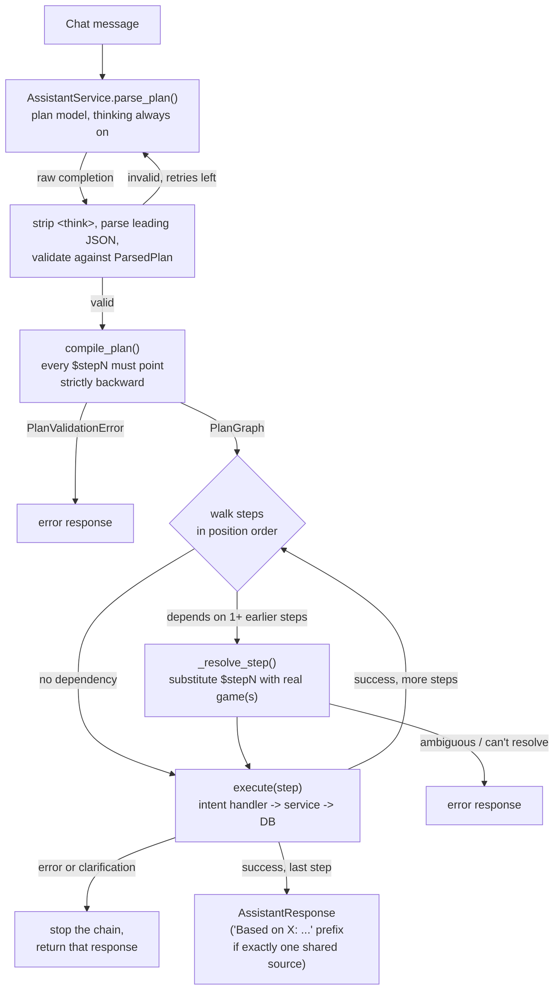

# AI Assistant

**Status: Implemented for all 8 intents, including multi-step plans where a later step depends on an earlier one's result. Stateless (no multi-turn memory) despite an accepted-but-unused `conversation_id` field.**

## Problem

Let a user express what they want in natural language ("economic games for 2-4 players", "compare the heaviest game to the highest-rated game") from a chat sidebar, instead of manually operating the filter sidebar or naming games one at a time.

## Inputs and outputs

Input: a free-text message (plus an accepted-but-ignored `conversation_id`, see [Known limitation](#known-limitation-no-multi-turn-memory) below). Output: a typed `AssistantResponse`, a `type` (`search_results` | `recommendations` | `clarification` | `game_detail` | `community_consensus` | `reviews` | `comparison` | `unsupported` | `error`) plus structured `data`, rendered by `AssistantMessageBubble` as inline cards, not free text.

## Approach: structured JSON parsing, not a semantic classifier

Not a semantic embedding classifier, and not an open-ended agent loop. The LLM's only job is understanding and planning: it fills in a typed `ParsedIntent`/`ParsedPlan` schema, and everything downstream (which service gets called, how a later step's placeholder gets filled in, what happens on failure) is ordinary deterministic application code. A wrong answer is either a bad plan, fixed in the prompt, or a bad execution, fixed in the code, never both at once.

Two different local models serve two different code paths, chosen from direct measurement, not preference:

| Route | Model | Thinking | Why |
|---|---|---|---|
| `POST /api/assistant/parse` (debug only) | `Qwen/Qwen3-4B-MLX-4bit` | off (`/no_think`) | Single-intent classification, `AssistantService.parse_query()`. Never shown a reliability problem at this size. |
| `POST /api/assistant/chat` (live traffic) | `Qwen/Qwen3-30B-A3B-MLX-4bit` | always on | Has to decide *whether* a request decomposes into steps and keep a multi-object plan structurally correct, `AssistantService.parse_plan()`. Measured directly against this server: the small model produced a repeatable structural JSON bug (one extra trailing brace, byte-identical across temperatures 0.0 and 0.3, not a sampling fluke) and real intent misclassifications on harder queries. Latency isn't a project constraint (2.3s to 17.9s for one query was an accepted trade), so thinking mode is never gated behind a faster first attempt. |

Both models are served by the same local `mlx_lm.server` instance. It loads a model on first request by HuggingFace repo id, not just the one passed to `--model` at startup, and is configured via separate `LLM_MODEL_NAME`/`PLAN_MODEL_NAME` settings so either could point at a different server or instance independently. See [docs/setup/README.md](../setup/README.md).

Either call sends the full JSON schema (`ParsedIntent.model_json_schema()` or `ParsedPlan.model_json_schema()`) embedded in the system prompt, plus 26 numbered rules with worked examples, grouped by concern (tag vocabulary, field-filling mechanics, sort-vs-filter for every numeric dimension, intent disambiguation, then multi-step planning mechanics) rather than by when each rule was added, so the model doesn't have to re-derive an underlying principle from a pile of one-off patches. `response_format={"type":"json_object"}` is sent but not enforced server-side: `mlx_lm.server` never reads that field, confirmed by reading its request-parsing code, not assumed. Validity is entirely the model's own instruction-following plus what's described next.

### Parsing is repair-first, not trust-first

Every completion goes through the same pipeline regardless of which model produced it:

1. **Prompting**: the schema and rules, described above, ask for a specific shape.
2. **Repair**: strip a leading `<think>...</think>` block (thinking mode prefixes one), strip markdown code fences, then parse only the *first complete JSON value* with `json.JSONDecoder().raw_decode()` instead of strict all-or-nothing parsing. Measured directly: the plan model reliably appends exactly one extra closing brace after an otherwise complete, valid JSON object, reproduced byte-identically across temperatures, so a retry alone can't dodge it. Discarding trailing noise after the first valid value does.
3. **Validation**: `ParsedIntent.model_validate()` / `ParsedPlan.model_validate()`. This is the actual boundary between whatever the model produced and something the orchestrator can trust the shape of.
4. **Retry**: on a `ValidationError` or `json.JSONDecodeError`, retry up to `AssistantConfig.MAX_LLM_RETRIES` (2) times, bumping temperature from 0.0 to `RETRY_TEMPERATURE` (0.3) on later attempts. This helps a genuinely stochastic flake, an empty completion; it does *not* reliably escape a structural bug like the trailing-brace case above, which is what step 2 exists for.

There is no guarantee beyond this. No grammar-constrained decoding is used or currently available for this serving stack: `mlx_lm.server` (installed version 0.31.3) has no schema-aware or grammar-aware decode hook, confirmed by reading its source. Only repetition/presence/frequency-penalty logits processors exist. Real token-level enforcement would mean either patching the server with a hand-built incremental JSON-schema token masker (a nontrivial undertaking: incremental parsing, tokenizer-boundary alignment, escaping, recursive structures) or switching serving stacks. Neither has been done; this is a documented, deliberate scope boundary, not an oversight.

### `ParsedIntent` schema (`backend/app/schemas/assistant.py`)

```
intent: "browse" | "search" | "recommend" | "compare" | "get_game" | "get_reviews" | "get_aspects" | "unsupported"
needs_clarification: bool
clarification_question, query, game_name: optional strings
game_names: optional string list (compare only, 2+ titles or placeholders)
requested_facts: optional list of "rank" | "rating" | "complexity" | "player_count" | "age" | "playtime" (get_game only)
search_mode: "lexical" | "semantic" | "hybrid"
filters: GameFilters   (themes, mechanics, categories, subdomains, families, designers, artists, publishers,
                        min/max players, exact players, min/max complexity, min/max year, min/max playtime)
sort: SortSpec         (field: rank | rating | year | complexity | name | playtime, direction: asc | desc)
recommendation_family: "popularity" | "content" | "collaborative" | "hybrid"
recommendation_model, limit
step_id, depends_on_step   (multi-step plans only, see below)
```

`ParsedPlan` is `{ steps: List[ParsedIntent] }`, one or more steps, truncated to `AssistantConfig.MAX_PLAN_STEPS` (3) by the app after parsing, not requested of the model.

## Multi-step planning and execution

Most requests are one step. A second (or third) step exists only when a later field genuinely can't be filled in without an earlier step's result: the request names a game only by criterion ("the highest-rated strategy game"), not by title, and then asks something else about it, or names two separate criteria to find independently and compare.



### Plan IR: compile before executing

`backend/app/services/plan_graph.py`'s `compile_plan()` turns a raw `ParsedPlan` into a validated `PlanGraph` before anything runs. Every `$stepN` reference is checked to point at an earlier, existing step (`0 <= N < position`), which catches a self-reference, a forward reference, or a reference to a step that doesn't exist as one check, raised as `PlanValidationError`. Because references can only point backward by construction, the graph is acyclic for free: there's no separate cycle-detection pass, just position order as the topological order. `AssistantOrchestrator.execute_plan()` then walks a graph that's already known-valid; it never handles an out-of-range reference itself.

A step's identity everywhere is its *position* in `step_id` order, never the model's own `step_id` field. That field has been measured duplicated across steps in the same plan (both steps in a two-step plan reporting `step_id=0`), which would silently let one step's result overwrite another's if trusted as a dict key. Likewise, which step a placeholder depends on is derived from the literal `"$stepN"` string itself, never from the separate `depends_on_step` field: the model has been observed writing a correct placeholder while leaving `depends_on_step` unset or wrong.

### Resolving a placeholder: three shapes

`_resolve_step()` handles every dependency a step can have uniformly:

- **One dependency, resolves to one game** is ordinary substitution, e.g. `game_name="$step0"` for a `get_game` chained off a `browse`.
- **One dependency, resolves to many games** is the one case a single placeholder can stand for a whole group, `compare(game_names=["$step0"])` where step 0 was a `browse`/`search` with `limit>1` ("suggest some games and compare them"). Capped at `MAX_COMPARE_GAMES` (5).
- **Two or more distinct dependencies, each resolving to exactly one game** covers `compare(game_names=["$step0", "$step1"])`, where step 0 and step 1 are *independent* steps, each answering its own criterion (e.g. "compare the heaviest game to the highest-rated game": two separate `browse` steps, neither depending on the other, merging into one `compare`). If any of the referenced steps resolves to more than one game, that's reported as a clean error rather than guessed at, since comparing two open-ended groups of suggestions against each other isn't well defined.

Every name resolved this way is recorded in a request-scoped `self._known_bgg_ids` map, because it came straight off an earlier step's `GameResponse` and is already exact. `_handle_compare()` checks this map before falling back to the fuzzy `EntityResolver` for each name. Skipping it avoids a real, measured failure mode: re-running an already-exact, already-resolved title like "Witch Hunt" through the resolver built for typed-in user text spuriously raised `AmbiguousEntityError` on it, collapsing an otherwise-successful multi-game compare into a single clarification prompt.

If any step in the chain returns `type` `"error"` or `"clarification"`, execution stops there and that response is returned directly. This is failure isolation, not a guess at what to do with a broken dependency.

### A franchise/series name can now drive a real comparison

"Compare the Brass games" resolves today. The model routes it to `search(query="Brass", limit=N)` (a franchise/series name isn't real taxonomy, so it can't be a `browse` filter, see rule 10) feeding a one-to-many `compare` placeholder, the same mechanism as any other multi-valued compare chain. Verified directly: it returns a real comparison including "Brass: Birmingham," "Brass: Lancashire," and other entries in the series.

## Orchestration

`AssistantOrchestrator.execute()` (`backend/app/services/assistant_orchestrator.py`) dispatches on `intent.intent`, used both for a single-step plan and, via `execute_plan()` above, for each step of a multi-step one:

| Intent | Handler |
|---|---|
| `browse` | `GameService.get_games()` via `_map_filters` + `EntityResolver`; degrades to a text search if a filter value doesn't resolve against the real taxonomy |
| `search` | `SearchService.search()`; drops any filter value that doesn't resolve rather than failing the whole request. Supports an explicit field `sort` (rank/rating/year/complexity/name/playtime) instead of pure relevance ranking, restricted to the top `SORT_RELEVANCE_POOL_SIZE` (25) most-relevant candidates before re-sorting so a barely-relevant match can't win purely by scoring well on the sort field; see [docs/ml/search.md](search.md) |
| `recommend` | `RecommendationService.get_recommendations()`, model defaults to `hybrid` |
| `compare` | Resolves 2 to `MAX_COMPARE_GAMES` (5) named titles via `EntityResolver`/`_known_bgg_ids` and `GameService.get_game()`, renders a side-by-side comparison table |
| `get_game` | `GameService.get_game()`; if `requested_facts` is set, answers with a direct pointed statement instead of a full summary |
| `get_aspects` | `AspectService.get_game_aspects()` plus the game's `customer_summary`; returns the community consensus paragraph and per-aspect sentiment breakdown |
| `get_reviews` | `ReviewService.get_game_reviews()`; returns actual review text, distinct from `get_aspects`'s summary |
| `unsupported` | Returns a fixed, deterministically-worded decline; the message text isn't LLM-generated, since a small model can't be trusted to phrase a graceful redirect consistently |

If `needs_clarification` is set, or an `AmbiguousEntityError`/`EntityNotFoundError` is raised during entity resolution, the orchestrator returns a `clarification` response with up to 5 candidate matches instead of executing the intent.

## Entity resolution

`EntityResolver` (`backend/app/services/entity_resolver.py`) keeps class-level (shared across requests) lowercase-name caches for every tag type. It splits resolution into two paths: content tags (categories, subdomains, themes, mechanics, families) are cross-checked against every cache, since they're conceptually disjoint and this self-corrects an LLM field mis-assignment; credit tags (designers, artists, publishers) resolve only within their own field's cache, since a real person can legitimately hold multiple credited roles (Uwe Rosenberg exists as both a designer and an artist in the data, and cross-checking him against every cache produced a false ambiguity).

Game name resolution (`resolve_game()`) doesn't use a fuzzy-matching library (no `rapidfuzz`, no `difflib`); it delegates to `SearchService`'s lexical search mode, then applies simple logic on top: an exact case-insensitive match wins outright, exactly one lexical result is accepted as a match, and anything else raises `AmbiguousEntityError` (with candidates) or `EntityNotFoundError`. "Fuzzy" here really means whatever Postgres full-text search considers a match, not a dedicated string-similarity algorithm. A name already known exact from an earlier step's result (`_known_bgg_ids`, above) skips this path entirely.

## Known limitation: no multi-turn memory

`conversation_id` is declared in three places and used in none of them:

- `ParseRequest.conversation_id` (`backend/app/api/routes/assistant.py`): accepted, never read by either handler
- `ChatRequest.conversation_id` (`frontend/src/api/assistant.ts`): declared, never populated by any call site
- `AssistantDrawer.tsx`: the one call site only ever sends `{ message: text }`

Every `/api/assistant/chat` call is fully stateless. There's no rolling memory buffer, no session state, and no mechanism anywhere in the codebase for a follow-up query to reference an earlier turn. This is separate from multi-step planning above: a plan's steps can reference each other, but only within the single message that produced them.

## Failure modes and limitations

- No grammar-constrained or schema-enforced decoding for this serving stack (see [Parsing is repair-first](#parsing-is-repair-first-not-trust-first)). Validity relies on prompting plus repair-and-retry, not a token-level guarantee.
- No multi-turn conversation memory (above).
- No evaluation set of natural-language queries with expected parsed intents exists; parsing correctness is unverified beyond hand-run queries in `backend/test_orchestrator.py`, which is also currently out of date: it asserts the `compare` intent was removed, which was true two commits ago and is false today. A real regression suite, with the metrics `docs/roadmap.md` calls for (valid-schema rate, malformed-JSON rate, retry rate, latency), doesn't exist yet.
- `MAX_PLAN_STEPS` (3) is a hard, deterministic ceiling; a request that would genuinely need a fourth step gets silently truncated to three rather than re-prompted for a shorter plan.
- Sort/limit occasionally gets dropped by the plan model specifically in a multi-dependency compare (two independent steps merging into one compare), even though the identical instruction is followed reliably in a single-dependency chain. This is a real, measured prompt-sensitivity gap in a long system prompt, not a code bug: `_resolve_step()` correctly detects the resulting ambiguity and returns a clean error rather than guessing, but the request itself doesn't complete.

## Related code

- `backend/app/services/assistant_service.py`, `assistant_orchestrator.py`, `plan_graph.py`, `entity_resolver.py`
- `backend/app/schemas/assistant.py`, `game_query.py` (`SortSpec`, shared with search/browse)
- `backend/app/api/routes/assistant.py`
- `backend/test_assistant.py`, `test_assistant_retry.py`, `test_orchestrator.py` (all print-only, no assertions, and `test_orchestrator.py` is stale; see [docs/engineering/testing.md](../engineering/testing.md))
- `frontend/src/components/AssistantDrawer.tsx`, `AssistantMessageBubble.tsx`, `CompactGameRow.tsx`
- `frontend/src/api/assistant.ts`
