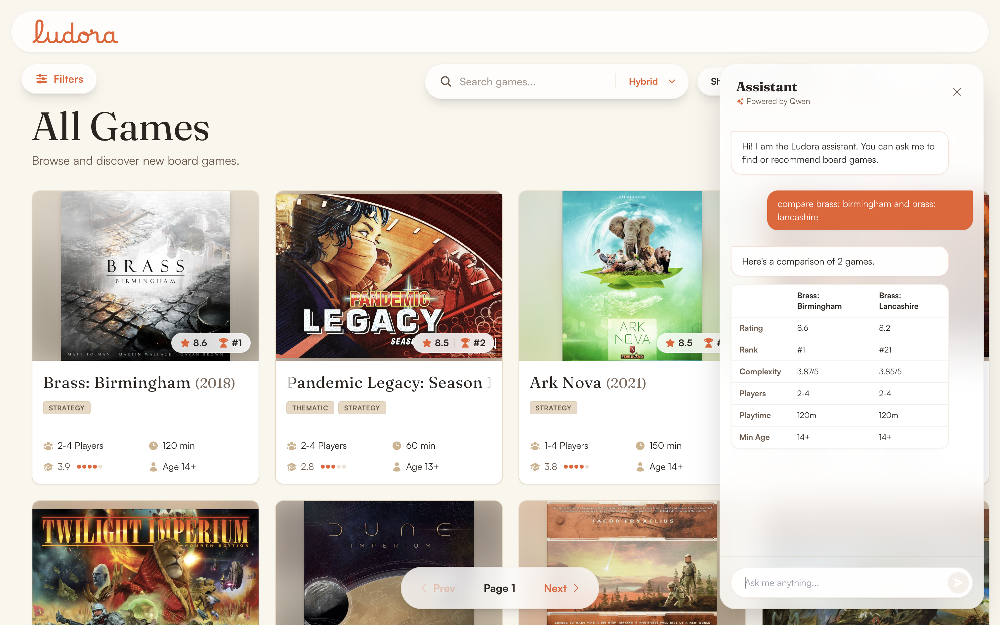
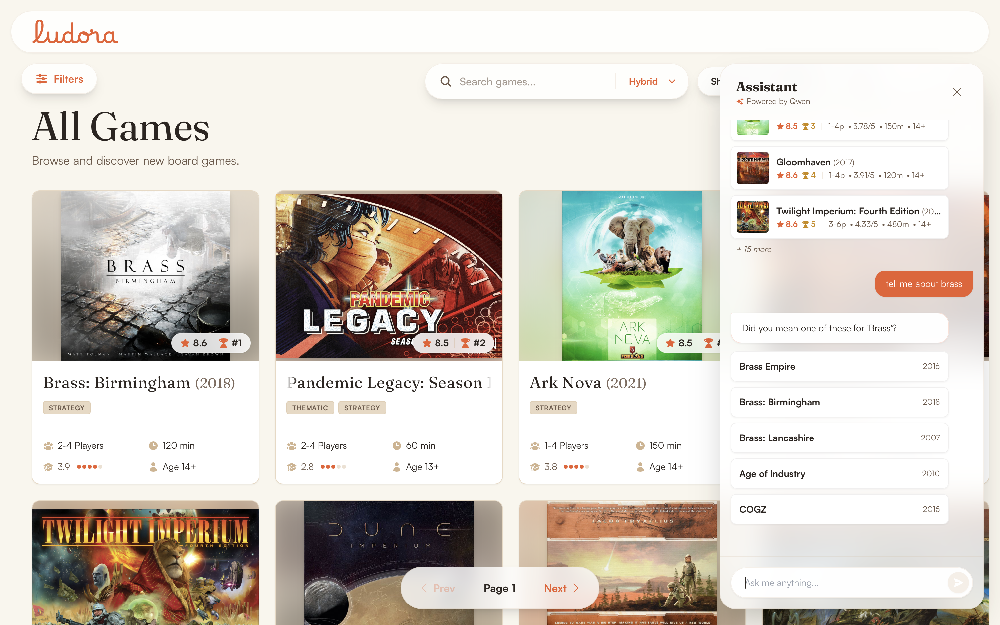
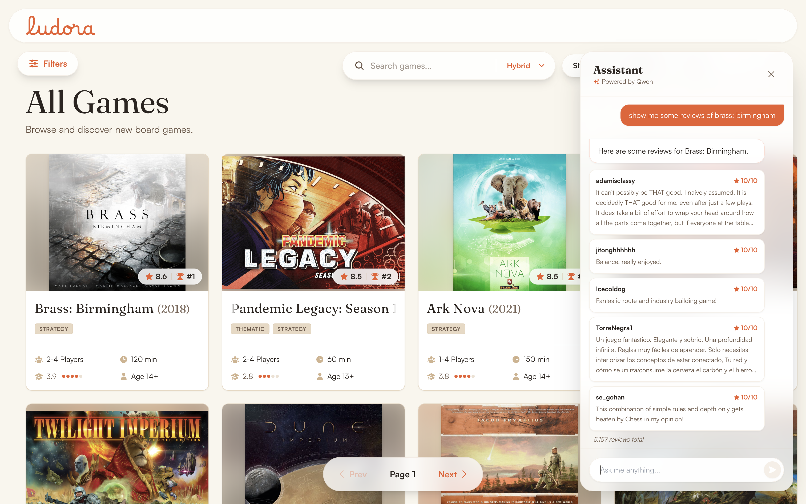
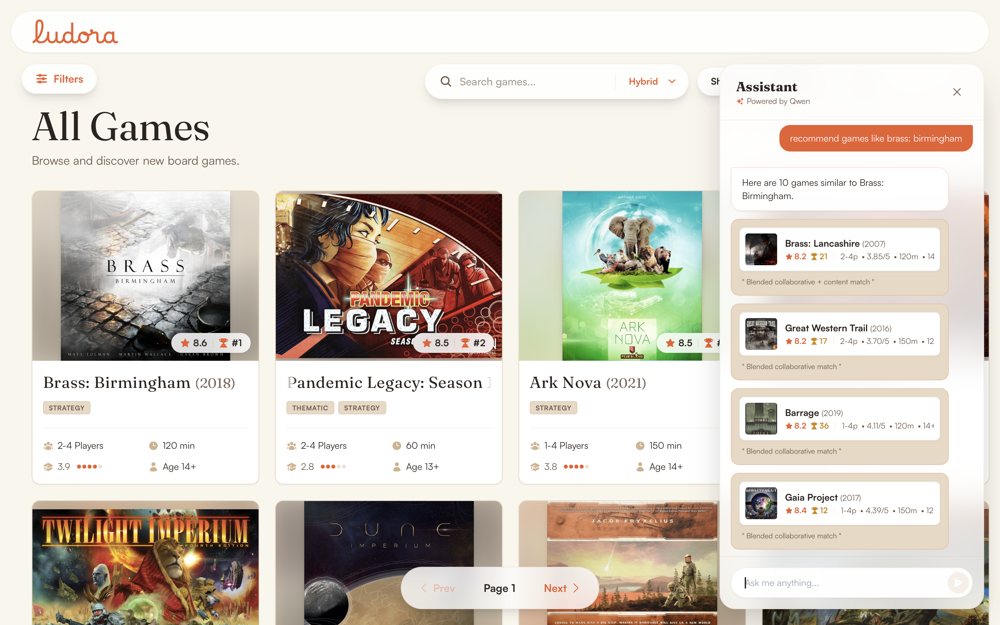
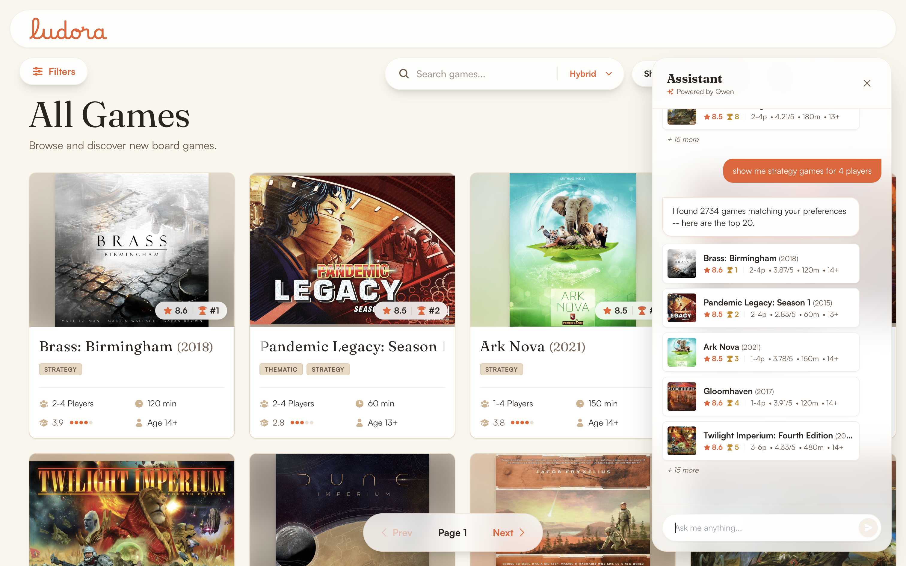
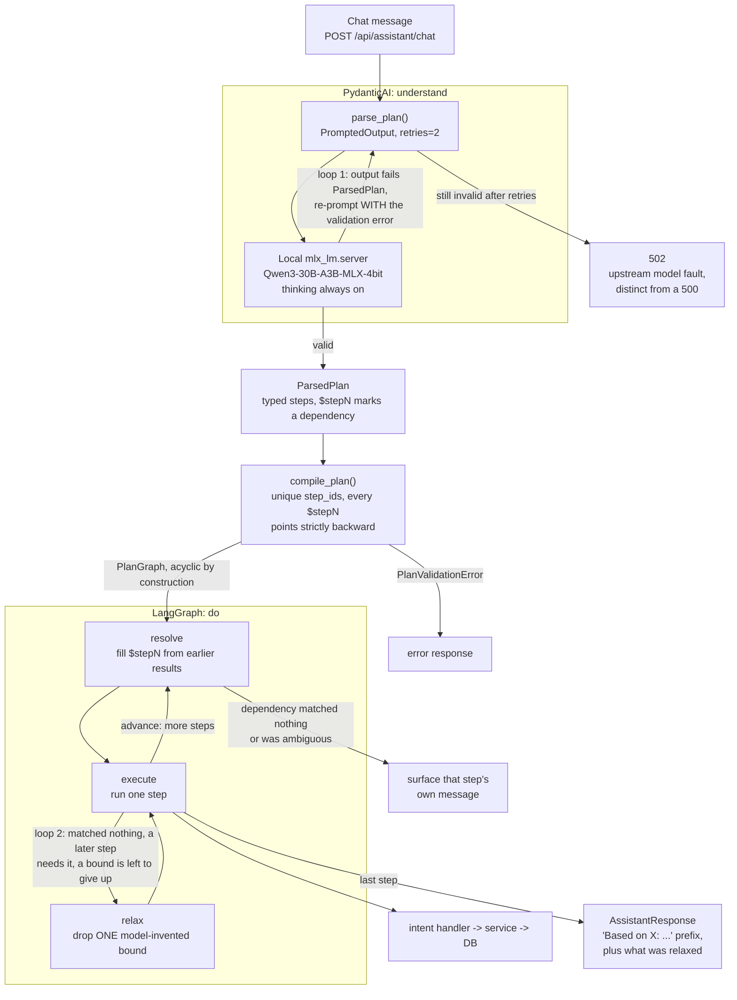

# AI Assistant

**Status: all 8 intents implemented, including multi-step plans where a later step depends on an earlier one's result. Stateless, despite an accepted-but-unused `conversation_id`**.

## Problem

Let a user say what they want instead of operating a filter sidebar. "Economic games for 2-4 players", or "compare the heaviest game to the highest-rated game".


Responses render as inline cards, not a chat transcript. Every intent dispatches to the same services direct browsing uses, so the assistant has no separate data path of its own.

| Request | Response |
|---|---|
| "compare Brass: Birmingham and Brass: Lancashire" |  |
| "tell me about Brass" (ambiguous) |  |
| "how old are you?" (out of scope) |  |
| "what do people think of Brass: Birmingham?" |  |
| "show me some reviews of Brass: Birmingham" |  |
| "recommend games like Brass: Birmingham" |  |
| "show me strategy games for 4 players" |  |

An out-of-scope question gets a decline rather than being force-mapped into a search, and an ambiguous title gets a question rather than a guess. Both are deliberate.

## The core decision: parse to a schema, execute deterministically

This is **not** a semantic classifier and **not** an open-ended agent loop. The LLM's only job is understanding and planning: it fills in a typed `ParsedIntent`/`ParsedPlan` (`backend/app/schemas/assistant.py`). Everything downstream is ordinary code the model never steers. That covers which service runs, how a placeholder is filled, and what happens when a step returns empty.

The payoff is diagnostic. **A wrong answer is either a bad plan, addressed in the prompt, or a bad execution, addressed in the code, never both at once**.

### Two models, chosen by measurement

| Route | Model | Thinking |
|---|---|---|
| `POST /api/assistant/parse` (debug) | `Qwen/Qwen3-4B-MLX-4bit` | off, `/no_think` |
| `POST /api/assistant/chat` (live) | `Qwen/Qwen3-30B-A3B-MLX-4bit` | always on |

The small model handles single-intent classification fine and has never shown a reliability problem at that size. It fails on planning. Measured directly against this server, it produced a repeatable structural JSON bug, one extra trailing brace. It was **byte-identical across temperatures 0.0 and 0.3**, so not a sampling fluke a retry could escape. It also misclassified intent on harder queries.

Thinking mode is never gated behind a faster first attempt, because latency is not a project constraint here. 2.3s to 17.9s for one query was an accepted trade.

One `mlx_lm.server` instance serves both, and the two settings could point at separate instances without code changes. See [setup/README.md](../setup/README.md#local-llm-server).

### Why `PromptedOutput`

Both calls run through [PydanticAI](https://ai.pydantic.dev/) agents in `PromptedOutput` mode. That is not the library default, and it was measured:

- **`NativeOutput`** (`response_format={"type":"json_schema"}`) fails on the plan schema whenever thinking mode is on, which `parse_plan()` always needs. It kept failing after `max_tokens` rose to this project's own 4,096, so it is not a token ceiling.
- **`ToolOutput`**, the default, works but adds a tool-call round trip for no benefit here.
- **`PromptedOutput`** is the one mode that serves both methods, and it matches what this service did by hand before adopting the framework.

The hand-written half of the prompt is the domain knowledge. It holds **24 numbered rules with worked examples**, grouped by concern rather than by when each was added. Rules 1-17 cover tag vocabulary, field filling, sort-versus-filter for every numeric dimension, and intent disambiguation. Rules 18-24 add planning. Grouping by concern means the model does not have to re-derive a principle from a pile of one-off patches.

Schema presentation and "return only JSON" are the framework's job, deliberately not restated alongside the rules, because two copies of a schema drift.

### Validation is the boundary, and a failure is fed back

Every completion takes the same path. Prompt, then PydanticAI checks it against the schema. On failure it **re-prompts with the specific validation error appended**, up to 2 more times. That last part is the whole design. The model learns what it got wrong instead of facing an identical question again.

**This is why the codebase no longer carries a repair layer**. An earlier version hand-rolled four workarounds for this exact stack. It stripped a leading `<think>` block and stripped markdown fences. It parsed only the first complete JSON value with `raw_decode()`, to tolerate a measured trailing-brace bug. It raised temperature from 0.0 to 0.3 on retries. All four are gone. PydanticAI parses thinking blocks into a separate `ThinkingPart` natively, and its error-carrying retry covers the class the temperature bump worked around.

**The dropped temperature bump looks like a regression and is not**. It existed because the old retry replayed a byte-identical prompt, so a deterministic malformation would reproduce every time and sampling jitter was the only escape. A retry that appends the validation error is a different, more constrained question, so the escape no longer has to come from randomness. Measured: a `model_validator` rejection repaired on the very next attempt at temperature 0.0, with the error text visible in the retry prompt. Everything now runs at 0.0, which also keeps a successful parse reproducible.

**Measured against the previous hand-rolled implementation**, same 45 runs on the same local server, 10 single-intent queries x 3 and 5 plan queries x 3:

| | Before | After |
|---|---|---|
| Single-intent parsing | 27/30 | **30/30** |
| Plan parsing | 15/15 | 15/15 |
| Retries fired | 0 | 0 |
| Median latency, single-intent | 0.8s | 1.2s |
| Median latency, plans | 9.7s | 10.6s |

The one query that changed verdict was "star wars themed games", `browse` on all three runs before and `search` on all three after. A franchise is not real BGG taxonomy, so `search` is right under rule 10.

**There is still no token-level guarantee**. `mlx_lm.server` (v0.31.3) has no schema-aware or grammar-aware decode hook, checked by reading its source. Only repetition, presence, and frequency-penalty logits processors exist. Real enforcement would mean hand-building an incremental JSON-schema token masker into the server. The alternative is a different serving stack. Neither has been done. That is a deliberate scope boundary, not an oversight.

## Multi-step planning

Most requests are one step. A second or third exists only when a later field genuinely cannot be filled without an earlier step's answer. Either the request names a game by criterion rather than title, or it names two criteria to resolve independently and compare.


```mermaid
flowchart TD
    MSG["Chat message\nPOST /api/assistant/chat"] --> AGENT

    subgraph Understand["PydanticAI: understand"]
        AGENT["parse_plan()\nPromptedOutput, retries=2"]
        LLM["Local mlx_lm.server\nQwen3-30B-A3B-MLX-4bit\nthinking always on"]
        AGENT --> LLM
        LLM -->|"loop 1: output fails ParsedPlan,\nre-prompt WITH the validation error"| AGENT
    end

    AGENT -->|"still invalid after retries"| E502["502\nupstream model fault,\ndistinct from a 500"]
    LLM -->|"valid"| PLAN["ParsedPlan\ntyped steps, $stepN marks a dependency"]

    PLAN --> COMPILE["compile_plan()\nunique step_ids, every $stepN\npoints strictly backward"]
    COMPILE -->|"PlanValidationError"| ERR["error response"]
    COMPILE -->|"PlanGraph, acyclic by construction"| RES

    subgraph Execute["LangGraph: do"]
        RES["resolve\nfill $stepN from earlier results"]
        EXE["execute\nrun one step"]
        RLX["relax\ndrop ONE model-invented bound"]
        RES --> EXE
        EXE -->|"loop 2: matched nothing, a later step\nneeds it, a bound is left to give up"| RLX
        RLX --> EXE
        EXE -->|"advance: more steps"| RES
    end

    RES -->|"dependency matched nothing\nor was ambiguous"| DEP["surface that step's\nown message"]
    EXE --> SVC["intent handler -> service -> DB"]
    EXE -->|"last step"| FINAL["AssistantResponse\n'Based on X: ...' prefix,\nplus what was relaxed"]
```

**The two loops repair different failures at different layers**, which is why both exist. Loop 1 is PydanticAI's: the output was *malformed*, so re-prompt with the error. Loop 2 is LangGraph's: the output was well-formed but the *request was unsatisfiable*, so loosen. A retry cannot help an impossible query, and relaxing cannot repair broken JSON.

### Compile before executing

`compile_plan()` turns a raw `ParsedPlan` into a checked `PlanGraph` before anything runs. Every `$stepN` must point at an earlier existing step (`0 <= N < position`). One check therefore catches three errors together: self-reference, forward reference, and dangling reference. **Because references can only point backward by construction, the graph is acyclic for free.** No separate cycle-detection pass is needed. Position order is the topological order.

Two things the model gets wrong, both defended against:

- **Step identity is always position**, never the model's own `step_id` field. That field has been measured duplicated across steps in one plan, both reporting `step_id=0`. As a dict key that would silently let one step's result overwrite another's.
- **Dependency comes from the literal `"$stepN"` string**, never from the separate `depends_on_step` field. The model has been observed writing a well-formed placeholder while leaving `depends_on_step` unset or wrong.

### Execution: a state machine with one recovery cycle

```
START -> resolve -> execute -> [route] -+-> relax -> execute   (the cycle)
                                        +-> advance -> resolve  (next step)
                                        +-> END
```

It is a LangGraph `StateGraph` rather than the linear loop it replaced **because of the `relax` branch**. Making plans acyclic by construction is the right guarantee for a structure an LLM wrote. It also means a step that legitimately matches nothing can only dead-end. "That came back empty, loosen it and try again" is a cycle the plan cannot express. The graph adds exactly that one cycle and nothing else.

**Recovery only ever gives up numeric range bounds**, never taxonomy filters or player counts. That split is not arbitrary. Rules 14 and 16 tell the model to *invent* those numbers when the user was vague, turning "light" into `max_complexity=2.0` and "quick" into `max_playtime=30`. They are the model's guess at a soft preference. Subdomains, categories, and player counts are what the user actually said. Loosening those would answer a different question.

**One bound at a time**, retrying after each, stopping at the first set that matches. Measured against the catalogue: "a quick, very heavy party game" (`max_playtime=30`, `min_complexity=4.9`) has no matches. Dropping only the complexity bound leaves three that are still quick. Dropping everything at once would discard the 30-minute limit the user *did* ask for. `_RELAXABLE_FILTERS` holds the order. Complexity comes first as the most likely invention, then playtime, then year last, since "from the 2010s" is usually stated outright.

**Termination is structural, not guarded**. `_relax` nulls the bound it drops, and `_next_bound_to_drop` only returns bounds still set, so each pass strictly reduces a finite count. No "already relaxed" bookkeeping, because that would be a second way of saying the same thing.

The branch fires only when all three hold. The step matched nothing. A later step needs its result, because otherwise "no matches" *is* the answer. A bound remains. When it fires the response says so: *"Nothing matched every constraint, so I relaxed min_complexity. Based on Blood on the Clocktower: ..."* Silently answering a looser question would be worse than failing.

Concretely, "what's the rating of the most complex party game with weight above 4.5" used to dead-end, because party games are light by definition. It now relaxes the invented bound and answers, with the caveat.

Topology compiles once at import and the per-request plan flows through as state. A `StateGraph` is topology and a `ParsedPlan` is data, so building a graph per request would be a category error as well as pointless. The recursion limit derives from `MAX_PLAN_STEPS` rather than LangGraph's default of 25, so raising the step cap cannot silently turn a legal plan into a `GraphRecursionError`.

**This cycle is the one place unbounded looping is even possible, so it is the part with tests**. `backend/tests/test_plan_executor.py` drives the graph with a fake orchestrator, no database and no LLM server, so it runs in CI. It pins that relaxation is minimal, and that it stops when nothing is left to give up. It also pins that it never fires when nothing depends on the empty step, and that taxonomy filters survive. The tests are mutation-checked. Dropping all bounds at once, failing to null a dropped bound, relaxing without a dependent, and relaxing taxonomy each produce a failing test.

### Resolving a placeholder: three shapes

`plan_resolution.resolve_step()` handles all three uniformly:

1. **One dependency, one game**. Ordinary substitution.
2. **One dependency, many games**. The only case a single placeholder stands for a group, e.g. `compare(game_names=["$step0"])` where step 0 was a browse with `limit>1`. Capped at 5.
3. **Two or more distinct dependencies, each one game**. "Compare the heaviest game to the highest-rated game" is two independent browses merging into one compare. If any referenced step resolves to more than one game, that is a clean error rather than a guess. Comparing two open-ended groups is not well defined.

A name resolved this way rides in the walk's own state, not on the orchestrator, because it belongs to one plan execution. Instance state would mean resetting by convention at the top of every run. It skips the fuzzy resolver entirely, which **avoids a measured failure**. Re-running an already-exact title like "Witch Hunt" through the resolver built for typed user text spuriously raised `AmbiguousEntityError`. That collapsed a successful multi-game compare into a clarification prompt.

If any step returns `error` or `clarification`, execution stops and that response is returned directly. Failure isolation, not a guess at what to do with a broken dependency.

**A franchise name can drive a real comparison**. "Compare the Brass games" routes to `search(query="Brass", limit=N)`, feeding a one-to-many compare placeholder. A series name is not taxonomy and cannot be a browse filter (rule 10). Checked directly: it returns Brass: Birmingham, Brass: Lancashire, and other entries.

## Orchestration and entity resolution

`AssistantOrchestrator.execute()` dispatches on intent, for a single step and for each step of a plan. Handlers map to `GameService`, `SearchService`, `RecommendationService`, `AspectService`, and `ReviewService`. Two are worth calling out:

- **`browse` degrades to text search** when a filter value does not resolve against the real taxonomy, rather than returning nothing. `search` drops the unresolvable value rather than failing the whole request.
- **`unsupported` returns a constant, deterministically-worded decline**. The text is not LLM-generated, because a small model cannot be trusted to phrase a graceful redirect consistently.

A `clarification` response with up to 5 candidates is returned when `needs_clarification` is set, or when entity resolution raises `AmbiguousEntityError`/`EntityNotFoundError`.

`EntityResolver` keeps class-level lowercase-name caches and **splits resolution into two paths for a reason**. Content tags (categories, subdomains, themes, mechanics, families) are cross-checked against every cache, since they are conceptually disjoint and cross-checking repairs an LLM field mis-assignment. Credit tags (designers, artists, publishers) resolve only within their own field, because a real person can hold several roles. Uwe Rosenberg exists as both a designer and an artist, and cross-checking produced a false ambiguity.

Game-name resolution uses **no fuzzy-matching library**. It delegates to lexical search, then applies simple rules: exact case-insensitive match wins, exactly one result is accepted, anything else raises. "Fuzzy" here means whatever Postgres full-text search considers a match.

## Known limitations

- **No multi-turn memory**. `conversation_id` is declared in the request schema, the frontend type, and nowhere populated. Every call is fully stateless. This is separate from multi-step planning: a plan's steps reference each other only within the single message that produced them.
- **No grammar-constrained decoding** on this serving stack (above). Validity rests on prompting plus check-and-re-prompt.
- **No evaluation set** of natural-language queries with expected intents. Correctness is unchecked beyond hand-run queries in `backend/test_orchestrator.py`, which is itself stale: it asserts the `compare` intent was removed, true two commits ago and false today. A real suite would need a hand-picked corpus of 40 to 60 queries, spanning every intent, every chaining pattern, and the known edge cases. Those are ambiguous names, franchise fallback, and multi-dependency compare. `pytest` is already a dev dependency.
- **`MAX_PLAN_STEPS` (3) is a hard ceiling**. A request genuinely needing a fourth step is silently truncated rather than re-prompted for a shorter plan.
- **Measured prompt sensitivity**. The plan model occasionally drops sort/limit in a multi-dependency compare, while following the identical instruction reliably in a single-dependency chain. Two prompt formulations were measured, and each repaired one of two adjacent cases while silently breaking the other, before a version holding both was found. That is genuine long-system-prompt fragility, not a code bug. `resolve_step()` detects the ambiguity and returns a clean error rather than guessing, but the request does not complete.

## Where the code is

- `backend/app/services/`: `assistant_service.py`, `assistant_orchestrator.py`, `plan_graph.py`, `plan_resolution.py`, `plan_executor.py`, `entity_resolver.py`
- `backend/app/schemas/assistant.py` holds `ParsedIntent` and `ParsedPlan`
- `backend/app/core/ml_config.py` (`AssistantConfig`), `backend/app/core/config.py` (endpoints)
- `frontend/src/components/`: `AssistantDrawer.tsx`, `AssistantMessageBubble.tsx`, `CompactGameRow.tsx`
- Tests: `backend/tests/test_plan_executor.py` (real, in CI). `backend/test_assistant*.py` and `test_orchestrator.py` are print-only, see [testing.md](../engineering/testing.md)
