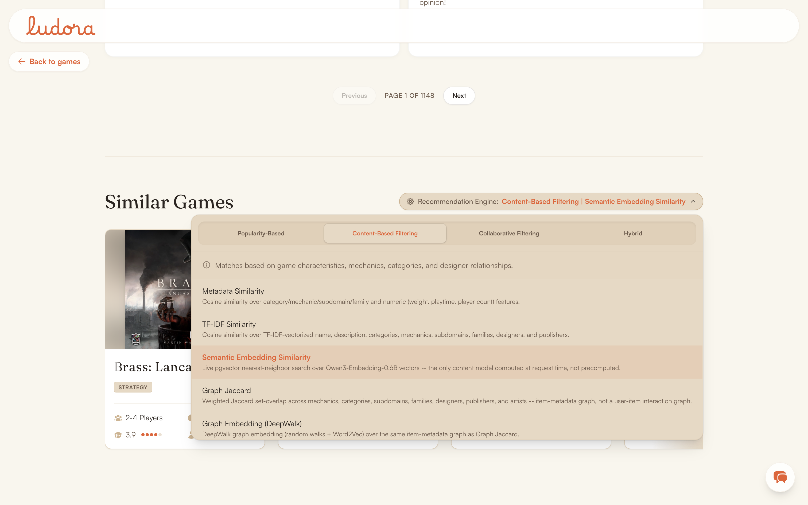

# Recommendation engine

**Status: all 9 model IDs are wired and served**. They range from a live database query, to genuinely distinct offline-precomputed algorithms, to a live cross-paradigm blend. This doc exists because that distinction is invisible from the UI.

## Problem

Given a game a user is looking at, suggest others they might like. Also let a technical visitor compare recommendation algorithms side by side on the same game. That comparison is the explicit purpose of the model-selector UI.

The tab groups are the four paradigms. Each model's one-line description is fetched from `GET /api/recommendation-models`, so there is no second hardcoded list in the frontend to drift.

## The 9 model IDs

Source of truth: `RECOMMENDATION_MODELS` in `backend/app/core/ml_config.py`.

| id | Paradigm | Computed | Served from |
|---|---|---|---|
| `popularity` | Popularity | Live | `games`, `ORDER BY rank ASC` |
| `metadata` | Content | Offline | `game_recommendations` |
| `tfidf` | Content | Offline | `game_recommendations` |
| `embedding` | Content | Live | pgvector cosine distance on `game_embeddings` |
| `graph_jaccard` | Content | Offline | `game_recommendations` |
| `deepwalk` | Content | Offline | `game_recommendations` |
| `cf_item_cosine` | Collaborative | Offline | `game_recommendations` |
| `cf_als` | Collaborative | Offline | `game_recommendations` |
| `hybrid` | Hybrid | Live | blends `cf_item_cosine` + `metadata` rows at request time |

Each id reads its own data. None share a fallback branch that would collapse distinct models into identical rankings.

**Graph models are classified as content, not collaborative**. Despite the word "graph," `graph_jaccard` and `deepwalk` build their graph purely from item metadata and never read the `ratings` table.

## Why these nine

- **No `ensemble` model**. An in-paradigm content blend once recombined embedding, metadata, TF-IDF, and a quality score with weights. It was not an independent signal, and it duplicated what the cross-paradigm `hybrid` already does.
- **No `cf_svd` model**. `TruncatedSVD` and ALS are both dense 50-dimensional latent-factor decompositions of the same ratings matrix. They would correlate more with each other than either does with `cf_item_cosine`. One CF pipeline, not two.
- **`themes` is not a separate feature anywhere**. BGG's `Theme:` namespace is already one of the Family namespaces, so using both would double-count the same tags.

## The decisions behind each model

**`popularity`** returns the same global top-N regardless of source game. That is deliberate. It is the non-personalized baseline every other model is implicitly compared against. Its score is normalized inverse rank, not a flat constant, so the UI can render it like any other model.

**`metadata`** is `0.7 * cosine(TF-IDF over categorical tags) + 0.3 * cosine(scaled numerics)`. **`tfidf`** is a single text blob per game through `TfidfVectorizer(max_features=10000)`. Both are unsupervised similarity, fit against no labeled objective.

**`embedding`** is the only content model computed live. It reuses the same vectors semantic search uses, so it always reflects current `game_embeddings` state rather than a stale precompute.

**`graph_jaccard`** weights seven relations: `mechanics=0.35, categories=0.25, subdomains=0.15, families=0.1, designers=0.05, publishers=0.025, artists=0.025`. Two games sharing many mechanics should count for more than two sharing one obscure artist. The weights are hand-chosen and renormalized at use time, not tuned against any signal.

**`deepwalk`** runs uniform random walks over that same graph, then skip-gram Word2Vec (`vector_size=64, window=5, epochs=1`). The id is `deepwalk` and not `node2vec` because uniform walks are a different algorithm from node2vec's `p`/`q` biased walks, and nothing here implements the biased variant.

**`cf_item_cosine`** mean-centers each user's ratings before building the matrix (Sarwar et al., 2001). Raw cosine cannot tell generosity apart from taste, so without centering a user who rates everything 8-10 looks similar to every item they touched. Only rated entries are centered, so an unrated item never becomes an implicit zero. Pairs sharing fewer than `min_shared_users=50` raters are zeroed, which stops one or two overlapping users from dominating.

**`cf_als`** converts ratings to Hu/Koren/Volinsky (2008) confidence weights, `confidence = 1.0 + 40 * rating`, before fitting (`factors=50, iterations=15, regularization=0.1`). `implicit`'s ALS has no concept of a negative observation. A raw 1-10 rating fed straight in would read 2/10 as "low-confidence positive" rather than "confident dislike". Alpha 40 is the paper's own default, not tuned here.

**`hybrid`** is `0.5 * collaborative_norm + 0.5 * content_norm` over `cf_item_cosine` and `metadata` rows, each min-max normalized first. It runs live rather than precomputed because both inputs are already top-10 lists. Combining them costs a few dozen floats and a sort, not an O(n²) matrix. The even split and those two representative models are a disclosed starting point, not tuned.

## Measured

- **ALS fit: about 77 seconds** on the real 26.2M-rating, 555,432-user, 27,825-game table. 15 iterations at roughly 5.19s each.
- **Precomputed coverage, checked against a live database:**

| Model | Games with rows | Of |
|---|---|---|
| `deepwalk` | 28,208 | 28,208 |
| `metadata`, `tfidf` | 28,207 to 28,208 | 28,208 |
| `graph_jaccard` | 28,205 | 28,208 |
| `cf_item_cosine`, `cf_als` | 27,825 | 27,825 rated |

`cf_als` writes the full 10 recs for every rated game, 278,250 rows, because it applies no sparsity threshold. `cf_item_cosine` does apply one.

## Evaluation

- `evaluate_recommenders.py` computes Coverage and ILD@10 for the 6 models that persist rows. It excludes `embedding` and `hybrid`, which are live and would read 0 rows, and `popularity`, which has no natural per-game list.
- `cf_split.py` computes Precision/Recall/NDCG@10 for the two CF models. It uses a per-user 80/20 split over 1,000 sampled active users, seed 42, where "liked" means rating ≥ 8.0.
- Both can log to MLflow and write a results file. Neither has been run to produce a committed one.

MLflow experiments: `recommender/content_based`, `recommender/graph`, `recommender/collaborative`. Models sharing a paradigm share an experiment, which is what makes them comparable in MLflow's run-comparison table.

## Known limitations

- **Coverage and ILD measure diversity and catalog reach, not whether the recommendations are good**. No ranking-quality evaluation exists for the 7 non-CF models, because there are no held-out relevance labels.
- **No evaluation covers `embedding` at all**, since it is served live rather than from stored rows.
- **No online feedback loop**. Nothing records which recommendations a user clicked.
- **No model versioning**. A rerun overwrites prior rows. `computed_at` records when a row was last written, not a history.
- **No re-fit trigger**. New ratings do not schedule anything. Every model is a manual, whole-catalog rerun.
- **DeepWalk runs 1 epoch**, against Word2Vec's own default of 5. Chosen for speed over the full catalog, not tuned against a quality metric.
- `HYBRID_ENGINE_WEIGHTS` and `GRAPH_JACCARD_WEIGHTS` are disclosed starting points, not empirically tuned.

No model artifacts are persisted to disk. Every fit is cheap enough to redo, so only the top-10 rows in `game_recommendations` survive a run. MLflow keeps the parameters and metrics.

## Where the code is

- Routing: `backend/app/services/recommendation_service.py`
- Recommender classes: `backend/app/recommenders/` (`base.py`, `collaborative/`, `utils.py`)
- Config: `backend/app/core/ml_config.py` (`RecommenderConfig`, `RECOMMENDATION_MODELS`)
- Precompute: `scripts/precompute_{content,graph,cf}_recommendations.py`
- Evaluation: `backend/evaluation/{evaluate_recommenders,cf_split}.py`
