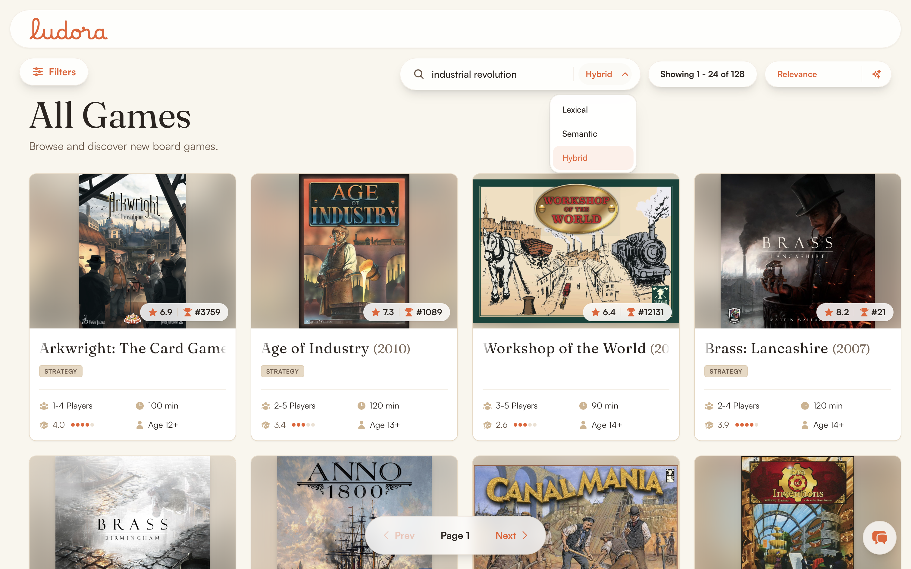

# Search

**Status: Implemented**. All three modes are live, request-time code paths. Nothing is precomputed or cached.

## Problem

Let a user find a specific game by name. Let them also describe what they want in natural language and still see relevant results when no keyword matches.



Neither top hit shares a keyword with that query. Brass: Birmingham and Brass: Lancashire come back, alongside Anno 1800, Age of Industry, and Arkwright, purely on semantic similarity.

Three modes exist because they fail differently, not because more is better. Lexical is exact and cheap and cannot handle a description. Semantic handles a description and cannot be trusted on a proper noun. Hybrid fuses their ranks.

## Query normalization

Every user-typed query is folded through `normalize_query()` (`backend/app/core/query_text.py`): collapse whitespace runs, then `casefold`.

**The fold is applied where a query enters, not inside each retrieval leg**, so no caller has to remember. `/api/search/` folds on the contract, via an `AfterValidator` on `SearchQuery.q`. That covers the route, the assistant orchestrator, the entity resolver, and the evaluation harness by construction. `/api/games/?query=` folds inside `GameService.get_games`, its only entry point, since it has no request model to hang a validator on. The legs hold no policy. They take a query and return matches. `EntityResolver.resolve_game` reuses the same fold, so the lookup has one notion of equality rather than two.

**Why it mattered, measured against the live catalog**. The embedding model is case-sensitive, so "catan" and "Catan" retrieved different neighbourhoods. Hybrid inherited the split through the RRF union: 149 matches topped by "Catan: Big Box" against 120 topped by "Catan Card Game". On the browse path an untrimmed `"catan "` went straight into a `LIKE` pattern. It required a literal trailing space, turning 46 matches into 14.

Both were reachable from an ordinary keyboard. iOS capitalizes the first letter of a search field and inserts a trailing space when a suggestion is accepted. The phone and the web therefore returned different games for the same keystrokes.

**`casefold`, not `lower`**, because this is a comparison and not a display transform. `lower` leaves the German sharp s alone, so "Straße" and "STRASSE" would stay distinct strings and encode to distinct vectors. BGG's catalog carries many German titles. Whitespace runs are collapsed rather than only trimmed. An internal double space splits a query for the encoder the same way a leading one does.

**A blank query retrieves nothing, in every mode**. An empty string is a perfectly good input to an embedding model, and its nearest neighbours are arbitrary games. A blank field used to answer with 100 confident-looking results in semantic and hybrid, while lexical answered with none. The guard sits in `search()` rather than in the legs. That is the only layer that can see whether filters were supplied. A request with filters and no text is a *browse*, not a search, and `_handle_search` routes exactly that case to `_handle_browse`. The LLM calls "strategy games for four players" a search often enough that a lower guard would answer it with nothing.

**Documents are not folded**. `scripts/update_embeddings.py` keeps natural case, so the query is slightly out of step with the corpus. That asymmetry already applied to every lowercase query anyone typed, the five evaluation queries included. Folding makes it uniform instead of dependent on whether the caller held shift.

The fold is the identity on all five evaluation queries, so the committed baseline stands, but those five therefore cannot detect a case regression. `evaluate_search.py` measures case invariance separately, re-running each query uppercased, title-cased, and padded, and checking the top-10 is identical. Behaviour is pinned by `backend/tests/test_search_query_normalization.py`.

## Lexical leg

Postgres full-text: `websearch_to_tsquery` against a weighted `search_vector`, ranked with `ts_rank_cd`. Weights are name = A, taxonomy tags = B, description = C, and designers/artists/publishers = D.

**The text search config is `english_unaccent`, not plain `english`** (migration `c4d8f21a9e56`). Plain `english` does not fold diacritics, so "Chvatil" against a tsvector built from "Chvátil" returned zero rows. Measured against the live catalog: about 9% of designers, 10% of artists, and 5% of publishers have non-ASCII names. Proper-noun search is the exact query class this leg is most relied on for, so that was a substantial silent failure. The build and the query must use the same config or the folding silently does nothing.

**`search_vector` is built by a manual batch script**, not a trigger and not an ORM event listener. There is no GIN index on the column. It must be rerun whenever tagged entities change.

**`ts_rank_cd` length normalization was tried and reverted**. Dividing by 1 + log(document length) was meant to discount long, description-heavy incidental matches. Normalization applies across the whole combined tsvector rather than per-field. It therefore penalized a legitimately relevant long document, a game whose own name was the query, as hard as an irrelevant one. That dropped an exact-name match out of the top 5, in favour of a weaker, shorter-description match.

## Semantic leg

`Qwen3-Embedding-0.6B` (4-bit DWQ), served locally through `mlx-embeddings` on Apple MLX, used off the shelf with no fine-tuning. Loading and encoding is centralized in `backend/app/core/embeddings.py`, so the script and the service cannot drift on load args or prefix handling.

**Why 4-bit DWQ over mxfp8**. mxfp8 measured about 0.47s per document on this hardware, which puts the 28,208-game catalog at 3 to 4 hours. MLX's fast-matmul path is more mature for 4-bit, and DWQ specifically targets near-full-precision quality despite the drop, unlike naive round-to-nearest. With the truncation and batching choices below, the full catalog measured about **32 minutes**.

**Truncation at 1,500 characters**. Raising it to 4,000 was tried, since Qwen3 supports 32K tokens. The median document was identical either way at 316 tokens, because most descriptions are already short. 4,000 nearly tripled the tail, p99 1,146 against 549. A long, flavor-text-heavy description also dilutes the pooled embedding rather than adding to it. `EMBED_MAX_TOKENS` is 768 against a measured p99 of 549 and max of 553. That ceiling is real headroom, not a cap doing work.

**Documents are sorted by length before batching**. `batch_encode_plus` pads every item in a batch to that batch's longest member. In raw DB order, one long outlier inflates its whole batch for no benefit. Sorting first measured about **2x faster** with identical output.

**Asymmetric instruction prefix**. Qwen3-Embedding is trained for instruction-aware retrieval, so the query carries a `QUERY_INSTRUCTION` prefix and documents are encoded plain. `encode(..., is_query=True)` only applies it for models listed in `INSTRUCTION_AWARE_MODELS`, so swapping in a non-instruction-tuned model will not wrongly apply it.

**Weight and playtime become phrases, not numbers**. The bucket ranges are kept identical by hand to the UI's own filter presets, so "heavy strategy game" uses the same vocabulary the filters do.

**Designers, artists, and publishers are excluded from the embedding document**. Lexical already covers proper nouns at the D-tier. Including them here would dilute thematic signal rather than add retrieval capability.

**Vectors live in `game_embeddings`, one row per `(game_id, model)`**, rather than a column on `games`. That lets more than one model's vectors coexist for comparison instead of a rerun silently overwriting the only copy. There is no ANN index, so this is an exact brute-force scan.

## Hybrid: Reciprocal Rank Fusion

Up to 100 candidates come from each leg, then ranks fuse with `k = 60`:

```python
l_score = 1.0 / (self.rrf_k + l_rank) if l_rank else 0.0
s_score = 1.0 / (self.rrf_k + s_rank) if s_rank else 0.0
rrf_score = l_score + s_score
```

Filters apply after fusion, not pushed into either leg's retrieval SQL.

## Field sort, with a relevance floor

A request can override relevance ordering with a field sort, which is how the assistant expresses "find X, sorted by Y". When it does, **sorting covers only the top 25 candidates by RRF score**, not the whole ~100 pool.

That floor exists because of a measured failure. Sorting the full pool for "find games with Spiderman in it, sorted by rating" surfaced "Slay the Spire: The Board Game" near the top. It sat at RRF relevance rank #44 of ~100 and outranked games with a real connection to the query, purely on its rating. A marginal match should not beat a strong one by scoring well on the sort field. Twenty-five leaves enough headroom to answer "top 3 by rating" meaningfully while still requiring every candidate to clear a relevance bar.

## Serving

Both legs score inside the FastAPI request. There is no separate search index, no cache layer, and no background scoring. Latency is Postgres plus one MLX `encode()` call.

## Evaluation

`backend/evaluation/evaluate_search.py` scores MRR@10, NDCG@10, and Recall@100 against the 5 hand-written queries in `search_queries.json`. Results are committed for all three modes at `backend/evaluation/results/`.

```bash
cd backend
uv run python evaluation/evaluate_search.py
```

MLflow experiment `search/retrieval_eval` holds all three modes as runs of one experiment, which is what makes them directly comparable. Embedding builds log to `search/embedding_build`.

## Known limitations

- **5 evaluation queries is a smoke test, not a benchmark**. No relevance-judgment methodology is documented for how their expected BGG IDs were chosen. It was manual curation, not a labeled dataset.
- **Discursive natural-language queries are a weak fit for the lexical leg by construction, not a tuning bug**. `websearch_to_tsquery` ANDs every bare word. "Heavy strategy game about trains" therefore matches only documents containing all four stems, measured at 7 games out of 28,208. English stemming also collapses senses: "train" the vehicle and "train" the verb share a stem. The semantic leg is what covers this class. Reweighting cannot reach it, because weights only reorder documents that already satisfy the AND.
- **Weight D conflates designers, artists, and publishers into one field**. Searching "Gavan Brown" (Brass: Birmingham's designer) also surfaces the "Dice Throne" series, where they are credited as artist. That is a real match in the wrong role, and there is no structured way to search by role. Tuning cannot fix it, because tuning does not add role awareness.
- **No relevance floor on the semantic leg**. It always returns its nearest 100 by cosine distance, however weak. There is no "I have no good answer" signal, so a low-information query still returns 100 confidently-ranked results. "Gavan Brown" surfaces "Goblins," "Goblin Vaults," and "Northern Branch: Firm With Brownies". The fix is a reranking stage, below.
- **Semantic cannot match on a designer name at all**, by the design decision above. Lexical still catches exact names at the D-tier.
- **No ANN index on either path**, so both do a full scan and will not scale past the current catalog.
- **`search_vector` and `game_embeddings` both need a manual rerun** to reflect changed games. `game_embeddings.created_at` is overwritten on each rerun, so the database alone cannot tell you whether a vector is stale. Only MLflow's run history can.

## Where the code is

- `backend/app/services/search_service.py`, `backend/app/core/{query_text,embeddings}.py`
- `backend/app/core/ml_config.py` (`SearchConfig`)
- `scripts/update_embeddings.py`, `scripts/update_search_vectors.py`
- `backend/evaluation/evaluate_search.py`, `backend/evaluation/search_queries.json`

## The planned fix: a reranking stage

A cross-encoder scoring `(query, candidate)` pairs after retrieval, uniformly across all three modes including hybrid post-RRF. Suggested model: Qwen3-Reranker-0.6B. Three things are already settled:

- **Selection should not be a fixed top-K.** Keep a maximum K but apply a score-gap cutoff on top. Scores of `0.94/0.92/0.91/0.90/0.89` then a cliff to `0.41/0.39/0.37` should cut at 5, while a smooth `0.83/0.81/.../0.69` should not be truncated just because K was reached.
- **It needs a richer document than the embedding one.** The embedding document deliberately excludes designers, artists, and publishers. A reranker scoring that same text would be exactly as blind to "who designed this".
- **`mlx-embeddings` cannot do it**, checked by reading its source rather than assumed. It has no reranker architecture for plain text, and its `qwen3` loader drops the LM head that Qwen3-Reranker's yes/no-logit scoring needs. A real path exists through the separate `mlx-lm` package, with pre-converted checkpoints under `mlx-community`. It means hand-implementing Qwen's prompt template and logit-scoring protocol against a low-level API, with no ready-made call, unlike the embedding swap.
