# Feature catalogue

The screenshots below are real captures of the running app (`docs/assets/images/`), not mockups. Most use **Brass: Birmingham** (BGG ID 174430) as the example game.

Each entry states what exists, how it's built, and what's genuinely missing or limited. No feature here is described as more finished than it is.

---

## 1. Game catalog: browse, filter, sort, search

A visitor wants to scan ~28K games and narrow them by concrete criteria rather than scroll everything.

The catalog renders as a paginated, responsive grid of game cards (box art, rating/rank badge, subdomain tags, complexity dots), with a collapsible filter sidebar and a sort control (Rank, Rating, Year Published, Complexity, Name, either direction). A search bar at the top switches between Lexical, Semantic, and Hybrid modes. This is the primary entry point; nearly everything else in the app is reached from here.

The sidebar is organized into four groups:

**Classification** (Subdomain, Category, Family) is where the one genuinely two-level filter lives. Family picks a namespace first (Animals, Mechanism, Setting, Crowdfunding, and so on), then the specific values inside it, since the raw [BGG](https://boardgamegeek.com/) Family field spans 72 namespaces and about 4,200 values and a flat list of that size isn't browsable.

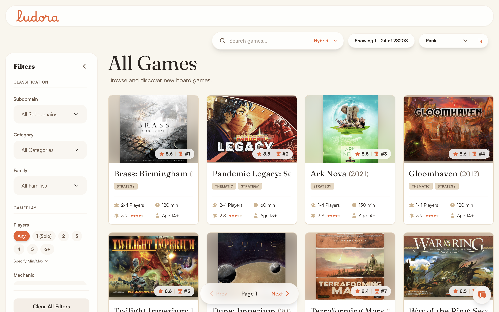

**Gameplay** (Players, Mechanic):

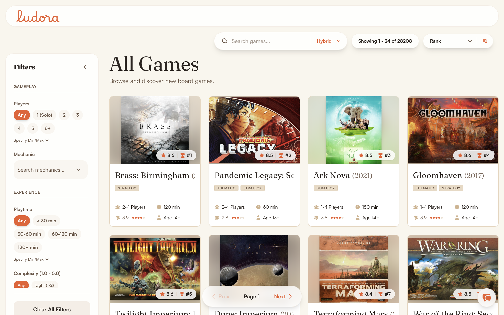

**Experience** (Playtime, Complexity):

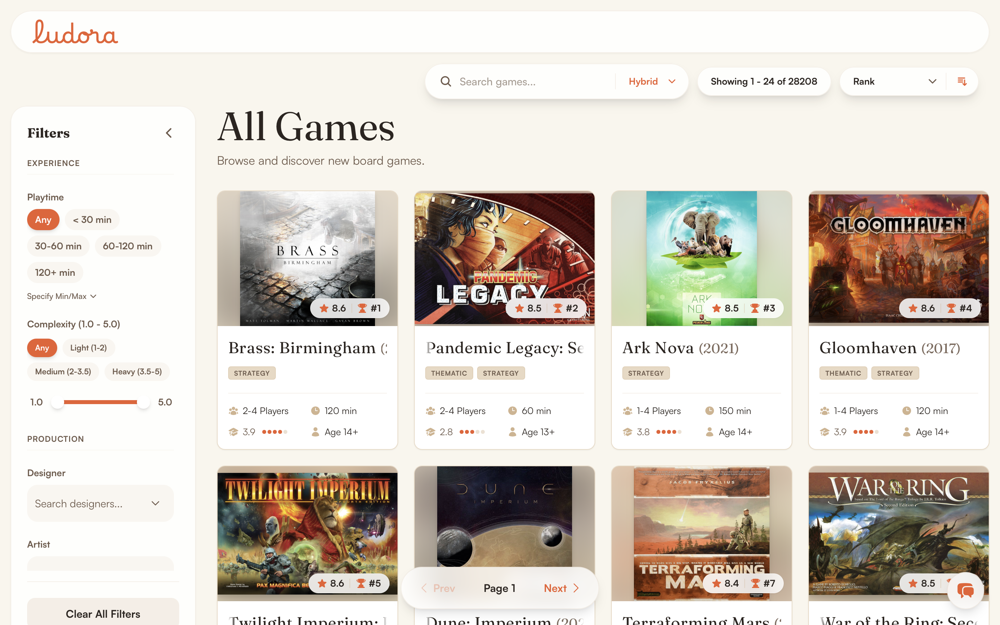

**Production** (Designer, Artist, Publisher, Year Published):

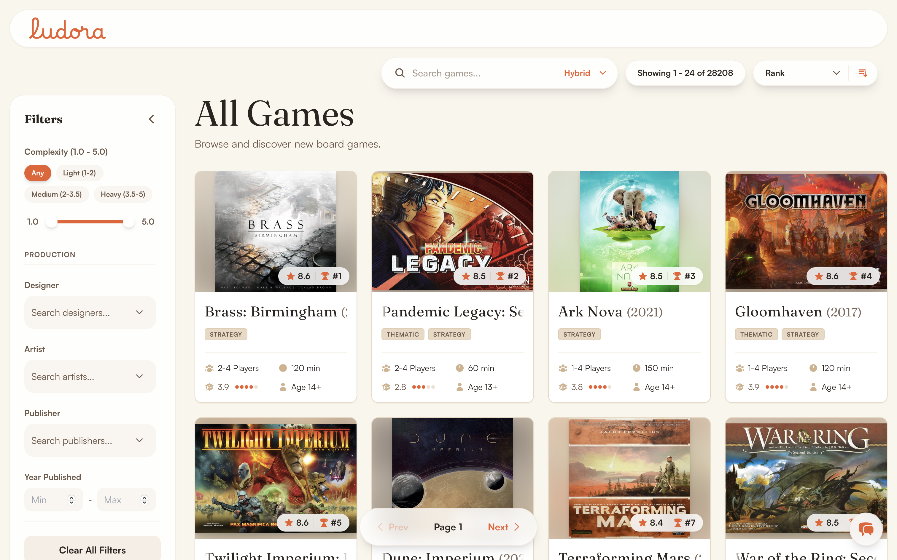

`frontend/src/pages/GamesList.tsx` drives a single React Query against either `GET /api/games` (browse) or `POST /api/search` (when a query is typed), keeping the prior page's results visible during refetch (`keepPreviousData`) so the grid doesn't flicker on every keystroke. Every filter maps directly to a `GameService.get_games()` / `SearchService.apply_game_filters()` parameter on the backend; nothing is filtered client-side. The Semantic and Hybrid search modes call the ML search pipeline; see [Hybrid search](#9-hybrid-search-lexical--semantic--rrf) below.

**Evidence**: `frontend/src/pages/GamesList.tsx`, `backend/app/api/routes/games.py`, `backend/app/services/game_service.py`. No automated test coverage; `backend/test_routes.py` exercises the underlying endpoint without assertions ([docs/engineering/testing.md](../engineering/testing.md)).

**Known limitation**: sorting and filtering aren't available at the same time as search. A search result list shows a static "Relevance" badge instead of the sort control.

---

## 2. AI Assistant

Some users would rather describe what they want ("economic games for 2-4 players") than operate a filter sidebar.

A floating chat drawer, present on every page, accepts natural-language messages and renders structured responses as inline cards instead of a plain chat transcript. `AssistantDrawer.tsx` posts to `POST /api/assistant/chat`, which `AssistantService.parse_query()` turns into structured JSON (a local LLM constrained to a `ParsedIntent` Pydantic schema), and `AssistantOrchestrator.execute()` dispatches to the same `GameService` / `SearchService` / `RecommendationService` / `AspectService` / `ReviewService` used by direct browsing. The assistant doesn't have its own separate data path.

This is a single-shot intent parser with a deterministic dispatcher, not an open-ended agent loop: one LLM call classifies the request into one of eight intents, then a fixed handler runs for that intent. Every intent resolves in one round trip, and there's nothing here that benefits from multi-step planning, since the handlers themselves are the plan.

**Comparing two games** renders as a side-by-side table instead of two separate cards:

**An ambiguous title** ("tell me about Brass") triggers a disambiguation prompt instead of guessing:

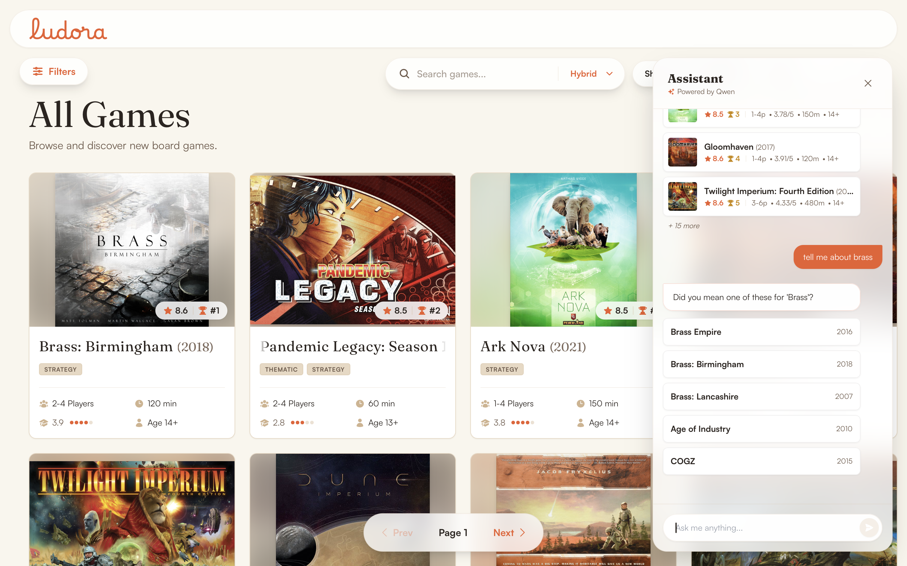

**A question with nothing to do with board games** ("how old are you?") gets a plain decline instead of being force-mapped into browse or search results:

**Opinion questions** ("what do people think of Brass: Birmingham?") return the same community consensus summary and per-aspect sentiment breakdown the game detail page shows:

**Requests for actual reviews** ("show me some reviews of Brass: Birmingham") return real review text instead of a summary:

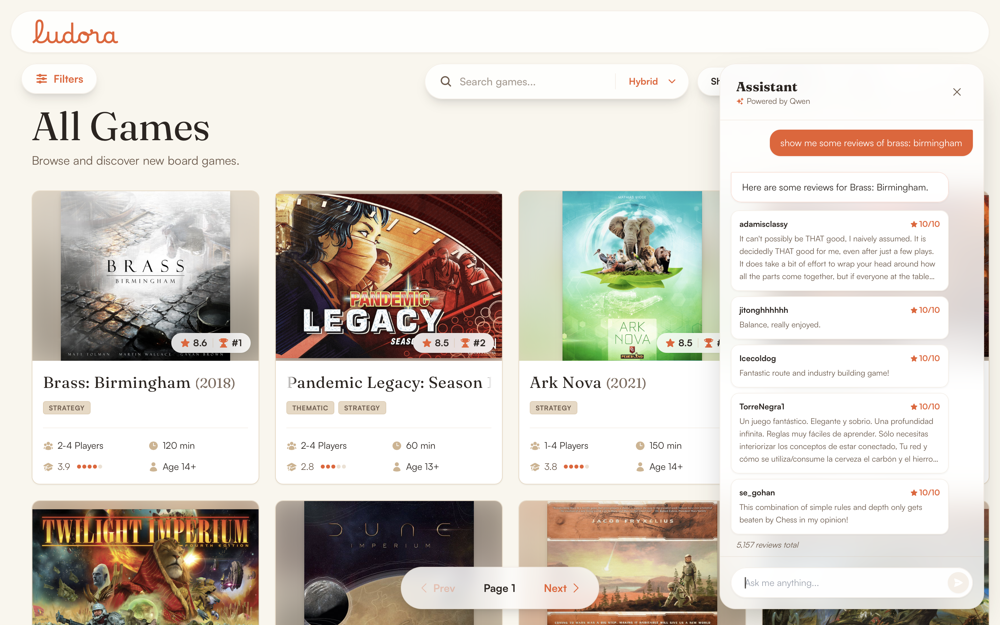

**Recommendation requests** ("recommend games like Brass: Birmingham") return cards with a stated reason per game:

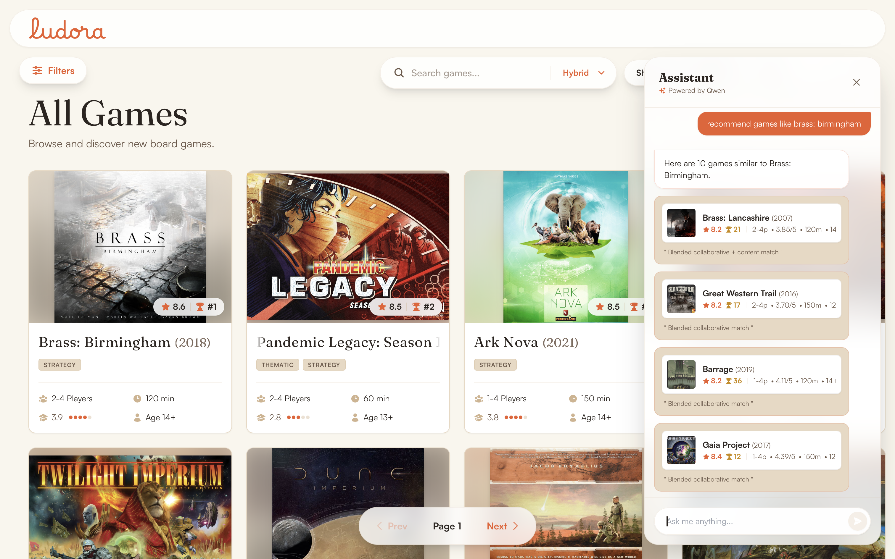

**Natural-language filtering** ("show me strategy games for 4 players") parses into structured filters and returns the same game cards a manual filter search would:

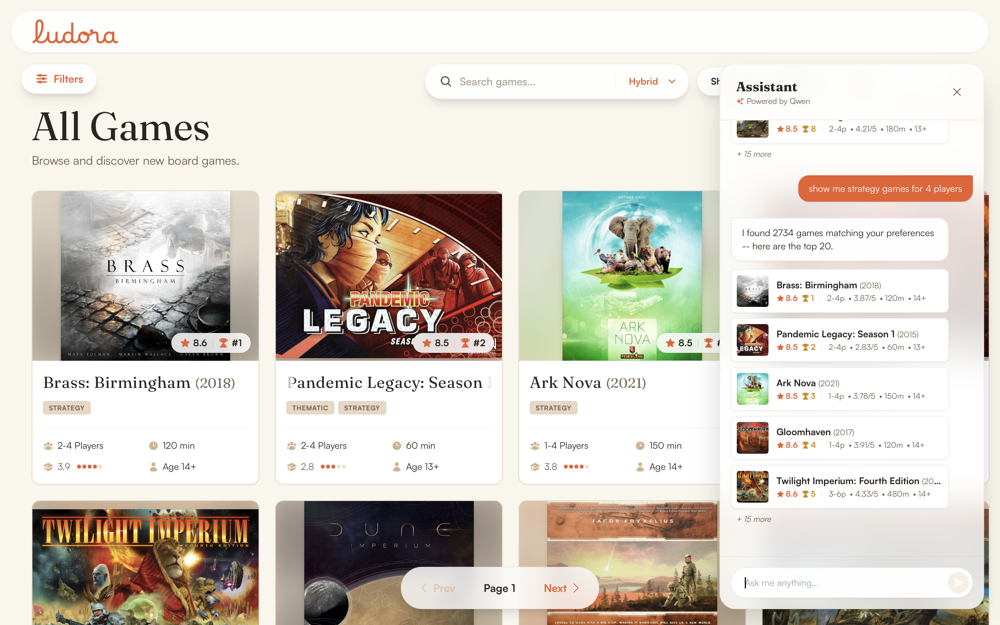

Full intent-parsing and orchestration design: [docs/ml/assistant.md](../ml/assistant.md).

**Evidence**: `backend/test_assistant.py`, `test_orchestrator.py` (print-only, need a live LLM server and/or DB; [docs/engineering/testing.md](../engineering/testing.md)).

**Known limitations**: there's no memory across turns; every message is parsed independently, despite a `conversation_id` field existing in the request schema. `compare` needs two or more named titles; a franchise or series reference ("compare the Brass games") doesn't resolve to a concrete pair yet. Detail: [docs/ml/assistant.md](../ml/assistant.md#known-limitation-no-multi-turn-memory).

---

## 3. Game detail page

Once a user picks a game, they want one page with everything about it: description, credits, taxonomy, core stats, without leaving to another site. This is the page most other surfaces link to, so it sets the visual bar for the rest of the app.

The hero section shows box art, title, year, a bold Subdomain pill (Strategy, Party, Thematic...) followed by outline Category pills (Economic, Fantasy, Card Game...), and a 6-tile stats block (rank, rating, playtime, players, complexity, min age).

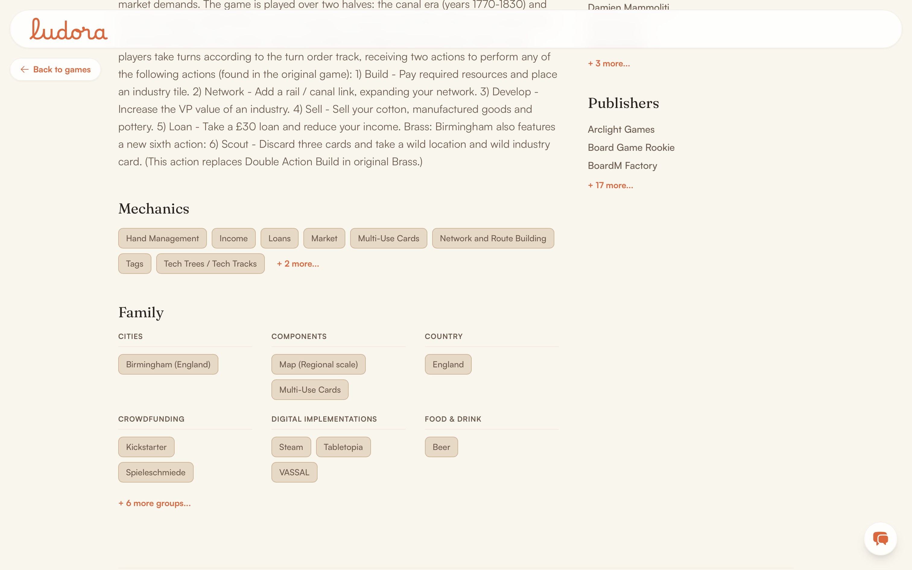

Further down, Mechanics and a grouped Family section (namespace headers over chip clusters, like "Components: Map (Regional scale), Multi-Use Cards", in a responsive grid collapsed past the first 6 groups) sit alongside Designers, Artists, and Publishers.

`GameDetail.tsx` (1,383 lines) fetches `GET /api/games/{bgg_id}` once and renders every section below from that single response. Description HTML is sanitized with `DOMPurify` before `dangerouslySetInnerHTML`, the only use of `dangerouslySetInnerHTML` in the codebase, and it's guarded.

**Evidence**: `backend/test_routes.py` smoke-checks `GET /api/games/{bgg_id}` (no assertions).

---

## 4. Statistics & distribution charts

A single number ("complexity: 3.9") is hard to read without context. Is that high or low against the rest of the catalog?

For the Official numbers (manufacturer-stated playtime, minimum age) and the Community numbers (community-reported playtime range, complexity, suggested player count and age polls), the page renders a smoothed density curve (a "This Game" marker, a dashed catalog-average line) plus a cumulative-distribution percentile readout against the full catalog. It's hand-built SVG, not a charting library, the most visually distinctive engineering piece in the app.

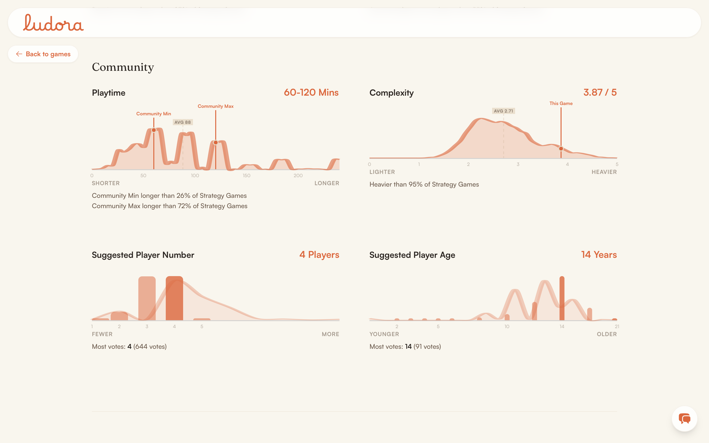

`scripts/generate_distributions.py` reads `data/raw/games.csv` directly, clips per-metric outliers to fixed ranges, box-smooths (`np.histogram` + `np.convolve`) Complexity and Playtime, and writes a static `frontend/public/distributions.json` (25 KB, committed). `DistributionChart` (`GameDetail.tsx:170-314`) fetches that file and draws the curve as a hand-computed SVG path with Catmull-Rom-style smoothing; percentile lookup is a nearest-index CDF search. Worth being precise about: these are box-smoothed histograms, not true Gaussian KDE, visually close but a different method underneath.

Overall and per-subdomain rank badges render as a separate component just below the distributions, reading the same `rank` and `subdomain_ranks` fields the hero section's stat tiles use.

**Evidence**: `frontend/public/distributions.json` is committed and can be inspected directly; the generation script is deterministic and rerunnable.

---

## 5. Ratings histogram & recommendation gauge

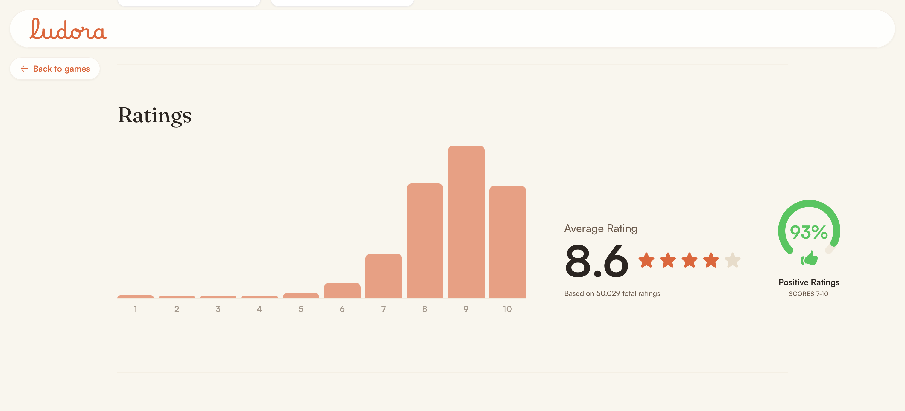

A 10-bar histogram of community ratings in 0.5-point increments (19 raw buckets grouped into 10 visual bars), and an arc gauge for the percentage of ratings ≥ 7.0 ("Recommended"). `UserRatings` (`GameDetail.tsx:398-569`) reads the `rating_distribution` JSON column, populated by `scripts/populate_rating_distribution.py` via `GROUP BY game_id, ROUND(rating*2)/2.0` over the `ratings` table; real aggregation, not a model. The gauge is a 75%-arc SVG circle (`gaugeArcLength = 0.75 * 2 * π * radius`), stroke-dash-offset driven by the recommended percentage.

**Evidence**: sourced from `master_ratings.csv` (26.2M interaction rows) via the recomputation script above.

---

## 6. Review browsing

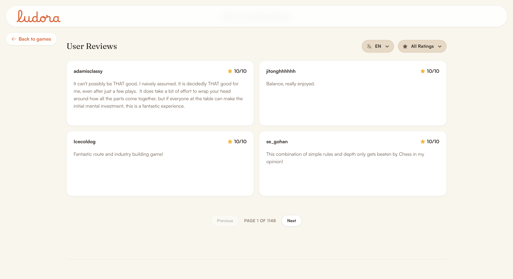

A paginated review list (4 per page) with a language filter (built dynamically from the response's own language breakdown) and a rating-bucket filter (positive ≥7, mixed 4-6.99, negative <4). `GameReviews` calls `GET /api/games/{bgg_id}/reviews` with `page, page_size, min_rating, max_rating, language`; filtering happens server-side, not in the browser. `keepPreviousData` plus a dimmed opacity during refetch keeps pagination from flickering.

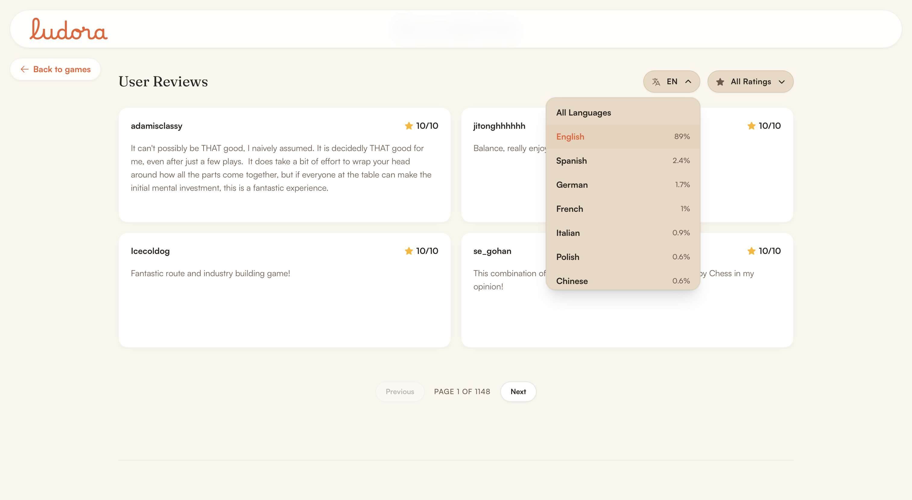

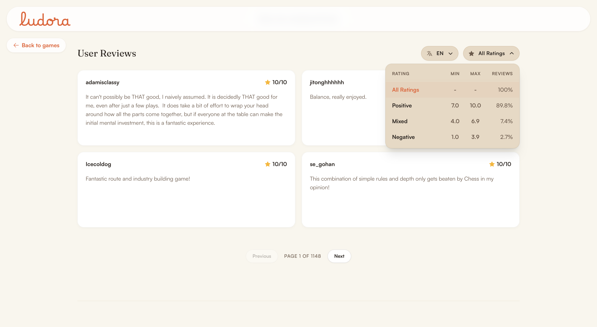

The `language` field itself is ML-derived; see [Review language & quality filtering](#8-review-language--quality-filtering) below.

**Evidence**: `backend/test_routes.py` smoke-checks the endpoint (no assertions).

---

## 7. Community Consensus (ABSA aspect cards + LLM summary)

Goes beyond a star rating to answer "what specifically do people like or dislike about this game," the most NLP-forward feature in the product.

A short LLM-generated paragraph synthesizing what reviewers said sits above a set of cards, one per game aspect (Mechanics, Strategy, Theme, and more), each with a mini arc-gauge and expandable past the initial 6. The paragraph and the cards are independently gated; a game with aspect data but no generated paragraph still shows the cards, just without the paragraph above them.

Each card reads as **Positive**, **Negative**, or **Mixed**, not a naive positive-vs-negative split. An aspect only claims a confident Positive or Negative label if that share of mentions clears 60% (`ABSAConfig.CARD_DOMINANCE_THRESHOLD`); a genuinely divided aspect (say 45% positive, 45% negative) falls back to a Mixed state (amber ring, scale icon) instead of an arbitrary plurality pick. Mixed cards show a paired positive and negative quote so the split is legible, not just asserted; confident cards show up to 3 quotes from the dominant side.

Two backend systems feed this one section. `AspectService` (`GET /api/games/{id}/aspects`) reads `game_aspect_aggregates`, rolled up from `review_aspects`, the output of a 17-aspect DeBERTa zero-shot classifier (`scripts/absa_extract_hf.py`), filtered to aspects with 5+ mentions (`ABSAConfig.MIN_MENTIONS_FOR_DISPLAY`). The paragraph comes from `game_summaries`, generated offline by `SummarizationService`, which calls a local LLM twice (per-aspect mini-summaries, then a final synthesis) under an explicit anti-hallucination prompt instruction. Full design: [docs/ml/absa.md](../ml/absa.md).

**Evidence**: end-to-end verified against 5 real games spanning different genres and review volumes (Brass: Birmingham, Pandemic Legacy: Season 1, Ark Nova, Gloomhaven, Twilight Imperium: Fourth Edition), confirmed live via `GET /api/games/{id}/aspects` and in the rendered page (screenshot above), including genuine Mixed-state cards, for example a 50/50 positive/negative split surfacing both quotes. No classification-accuracy evaluation exists.

**Known limitations**: the quality/eligibility filter has run over the full ~4.2M-review corpus (267,950 eligible); DeBERTa classification is running in resumable, time-boxed chunks and has attempted 39,484 of those so far (about 14.7%), not the full corpus yet ([docs/ml/absa.md](../ml/absa.md#coverage-full-corpus-filtered-not-sampled)). LLM summaries have only ever been generated for a handful of manually-specified games; no batch run exists.

---

## 8. Review language & quality filtering

Reviews are automatically language-tagged and, upstream, scored for ABSA eligibility with a cheap, model-free pipeline. `scripts/detect_languages.py` uses fastText's compressed `lid.176.ftz` model (~1MB, bundled at `data/models/`) to backfill `reviews.language` and `reviews.language_confidence` across the corpus. A separate quality/eligibility filter (`backend/app/core/review_quality.py`, run at full-corpus scale by `scripts/filter_eligible_reviews.py`), used only for ABSA eligibility, not the language filter dropdown, combines a language-confidence gate, hard filters (min length, valid Unicode, a VADER zero-sentiment check), exact/near-duplicate removal, and a weighted density/diversity/specificity/boilerplate score, thresholded at `0.6`. Full formula: [docs/data/README.md](../data/README.md#data-quality-rules-as-implemented-not-as-a-policy-document).

This isn't a user-facing feature with its own screen; it's listed here because it's a real, evidenced ML component feeding features 6 and 7 above.

---

## 9. Hybrid search (lexical + semantic + RRF)

See [feature 1](#1-game-catalog-browse-filter-sort-search) for the UI. This entry exists because the technique underneath is substantial enough to document on its own: exact/keyword search (Postgres full-text), "vibe"/descriptive search (sentence-embedding cosine similarity), and a fused mode combining both via Reciprocal Rank Fusion (`k=60`).

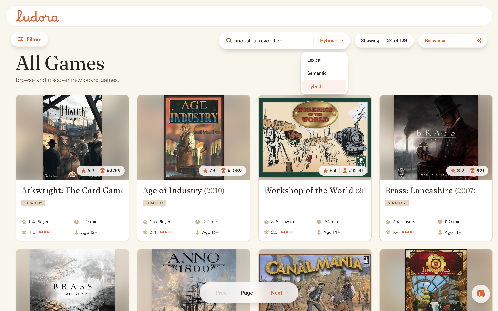

Neither of the top hits here shares a keyword with the query. Searching **an economic strategy game about the industrial revolution** in Hybrid mode surfaces Brass: Birmingham and Brass: Lancashire alongside Anno 1800, Age of Industry, and Arkwright, purely on semantic similarity.

`Qwen3-Embedding-0.6B` (via `mlx-embeddings`, local MLX inference) drives semantic mode; Postgres `websearch_to_tsquery`/`ts_rank_cd` drives lexical mode. Full detail, including the "no ANN index" and "no auto-sync tsvector" caveats: [docs/ml/search.md](../ml/search.md). Search evaluation results (MRR/NDCG/Recall across all three modes) are measured and committed: [docs/ml/evaluation.md](../ml/evaluation.md).

---

## 10. Recommendation engine & model selector

"What else might I like, given this game," and, for a technical audience, a rare chance to compare 9 recommendation algorithms side by side on the same game.

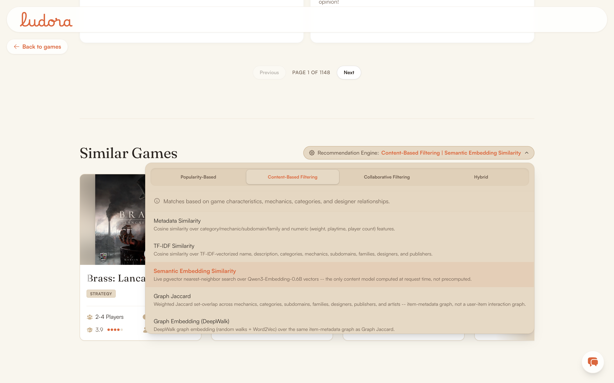

A tabbed model picker (Popularity-Based, Content-Based Filtering, Collaborative Filtering, and Hybrid) lists every model under the active tab, with a one-line description of how each one actually works, fetched live from `GET /api/recommendation-models` rather than hardcoded in the frontend.

Selecting a model live-refetches the recommendation list for it. This is the most ambitious single engineering surface in the app: 9 named strategies across popularity, content-based, graph-based, collaborative filtering, and a cross-paradigm hybrid blend, exposed for direct comparison.

`GameRecommendations` defaults to the `hybrid` model id and refetches `GET /api/games/{id}/recommendations?model=...` on selection. See [docs/ml/recommenders.md](../ml/recommenders.md) for exactly which model IDs compute live versus read from a precomputed table.

**Evidence**: Coverage/ILD diversity metrics for 6 of the 9 models are computed by `backend/evaluation/evaluate_recommenders.py`, which can log the run to MLflow and write a results file, but hasn't been run to produce a committed one yet, so these numbers are labeled "Observed" rather than "Measured" ([docs/ml/evaluation.md](../ml/evaluation.md)).

---

## Visual coverage

A system architecture diagram (Mermaid) exists in [docs/architecture/README.md](../architecture/README.md#system-diagram). Every feature and every AI Assistant response type above is backed by a real screenshot at `docs/assets/images/`. What's not captured yet is motion: a GIF of the assistant drawer mid-conversation, or a hero-to-stats scroll, would add interaction context but isn't required for this catalogue to be evidence-complete.
