# Ludora web client

React 19 + TypeScript + Vite. Reads the FastAPI backend over an absolute `VITE_API_URL`, not a dev-server proxy.

Conventions, tooling, and the rules for changing this code are in [AGENTS.md](AGENTS.md). This file is what the client looks like and the decisions behind it.

```bash
docker compose up -d frontend     # http://localhost:5173
```

Screenshots are real captures of the running app, mostly of **Brass: Birmingham** (BGG ID 224517). The backend must be running natively and the database populated, see [docs/setup/README.md](../docs/setup/README.md).

## Catalog

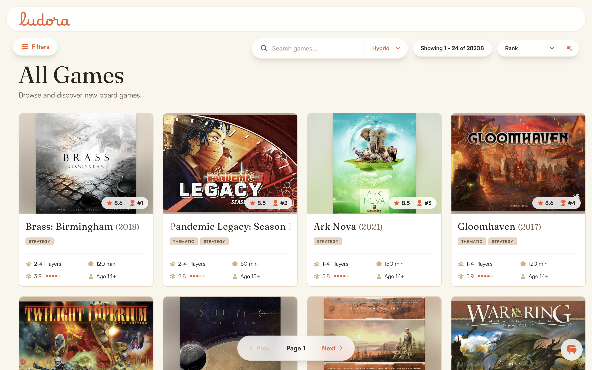

The primary entry point. A paginated grid over ~28K games, with a collapsible filter sidebar, a sort control, and a search bar that switches between Lexical, Semantic, and Hybrid.

**Every filter maps one-to-one onto a backend parameter. Nothing is filtered client-side**, so the sidebar and the API cannot disagree about what a filter means.

**`keepPreviousData` keeps the prior page visible during refetch**, so the grid does not flicker on every keystroke.

The sidebar has four groups. **Classification** holds the one genuinely two-level filter: Family picks a namespace first, then values inside it. That is not decoration. The raw BGG Family field spans 72 namespaces and about 4,200 values, and a flat list that size is not browsable.

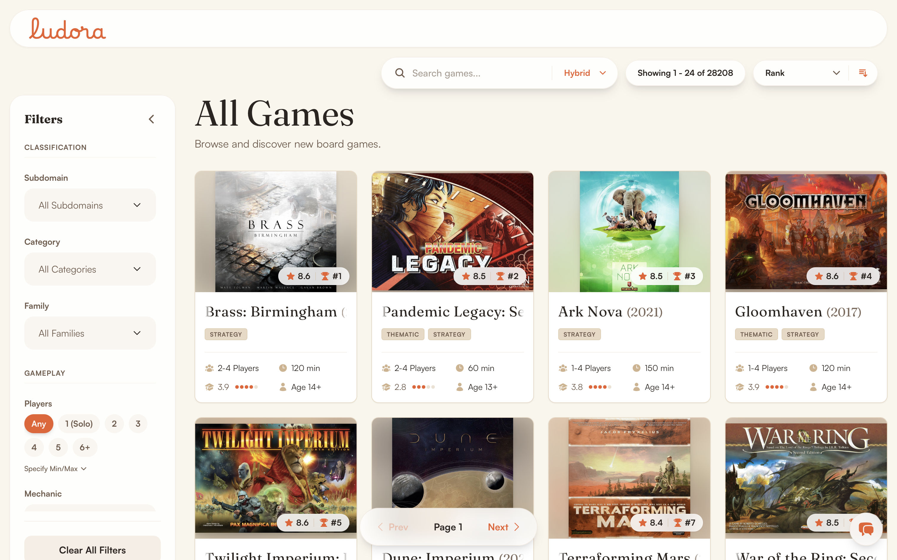

| Gameplay | Experience | Production |
|---|---|---|
| 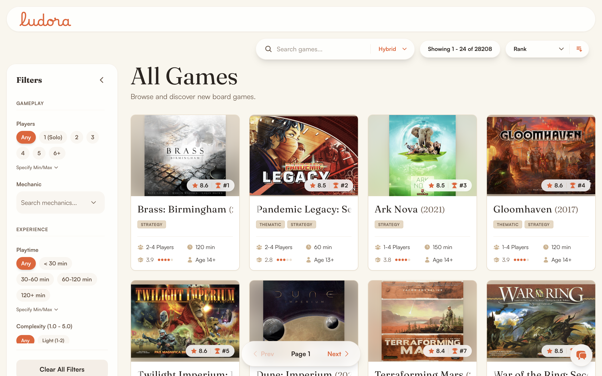 | 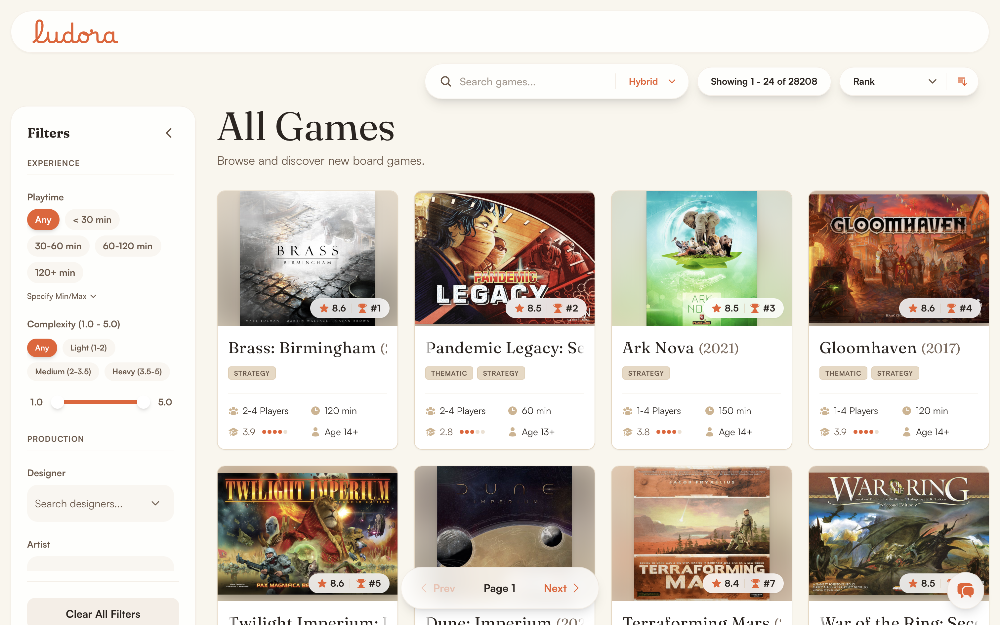 | 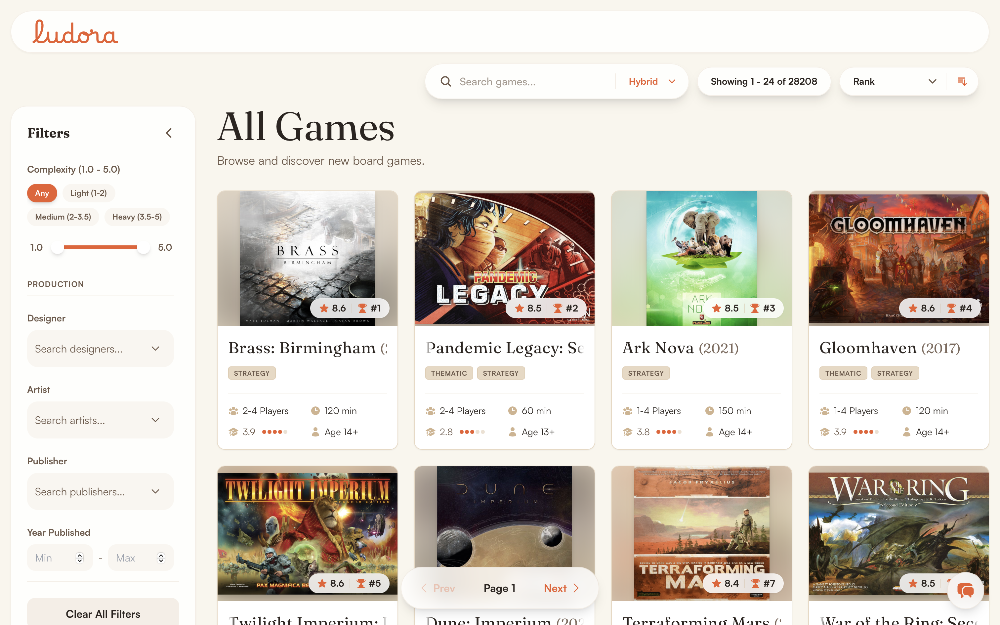 |

**Known limitation:** sorting and filtering are not available at the same time as search. A search result list shows a static "Relevance" badge instead of the sort control.

Search itself is three retrieval modes with different failure shapes, explained in [docs/ml/search.md](../docs/ml/search.md).

## Game detail

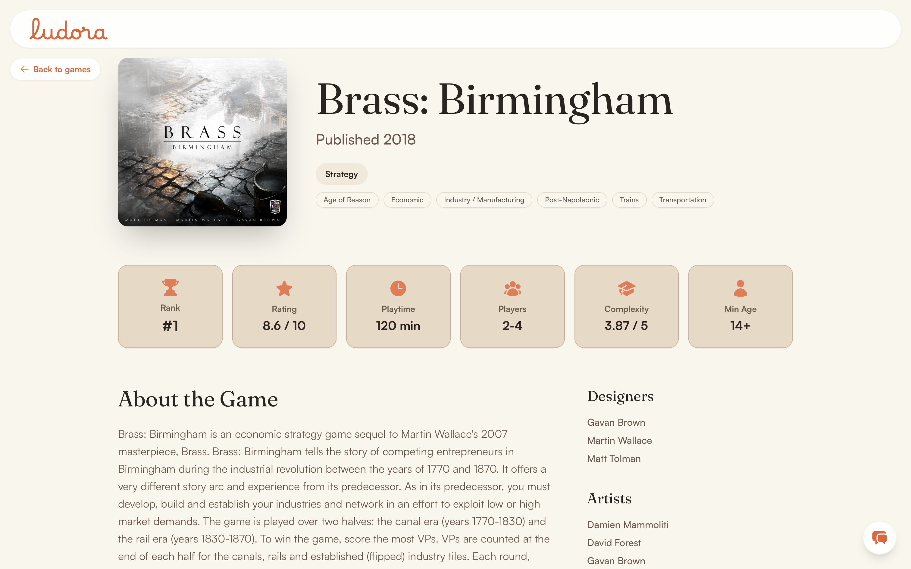

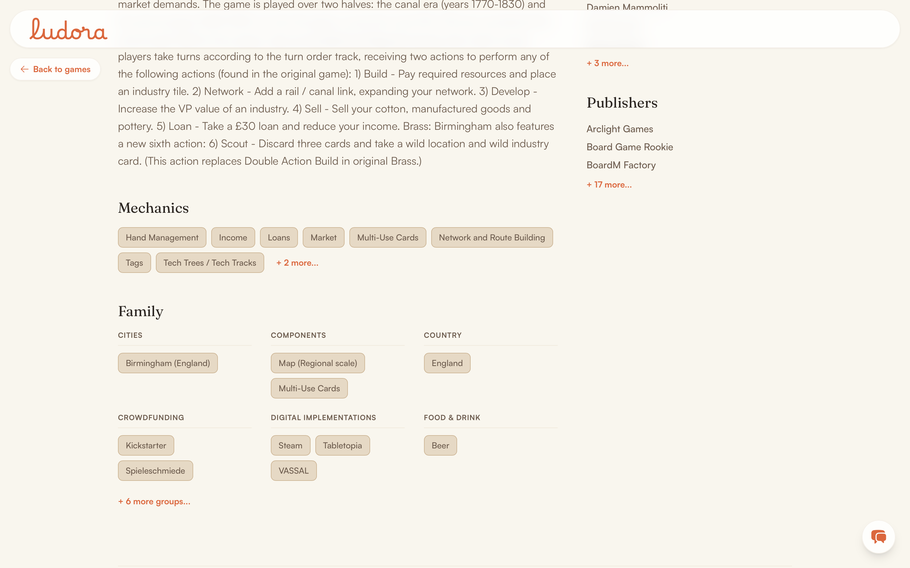

One `GET /api/games/{bgg_id}` call renders every section on the page. Family chips group under namespace headers and collapse past the first 6 groups.

**Description HTML is sanitized with `DOMPurify` before `dangerouslySetInnerHTML`**. That is the only use of `dangerouslySetInnerHTML` in the codebase, and it is guarded.

## Distribution charts

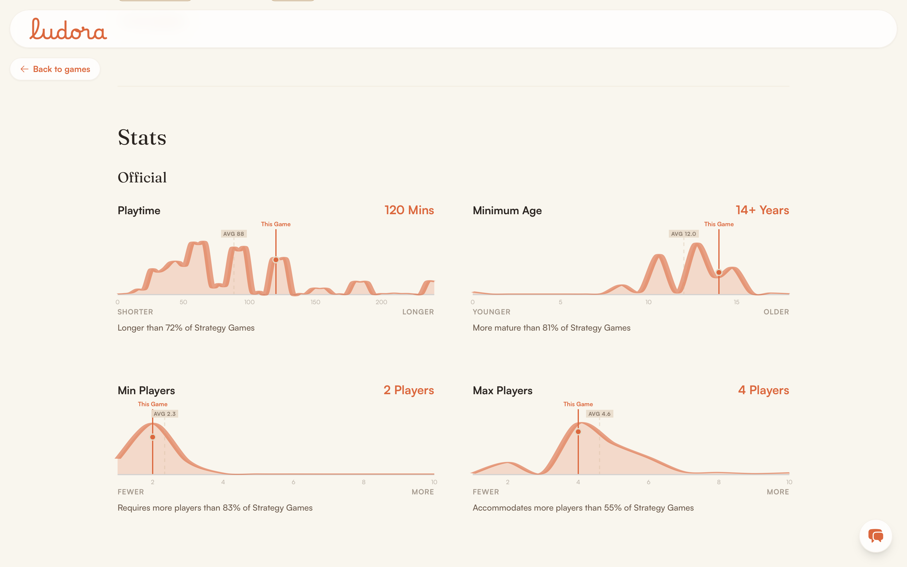

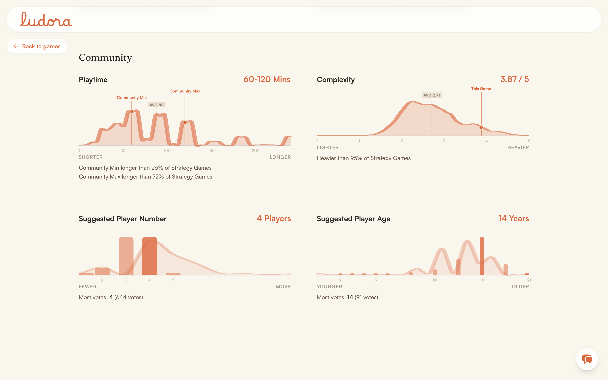

A single number like "complexity: 3.9" means nothing without the distribution behind it. Each metric therefore draws a density curve with a "This Game" marker, a catalog-average line, and a percentile readout.

**Hand-built SVG, not a charting library**. The curve is a computed path with Catmull-Rom-style smoothing, and percentile lookup is a nearest-index CDF search.

**These are box-smoothed histograms, not true Gaussian KDE**. Visually close, a different method underneath, and worth being precise about. `scripts/generate_distributions.py` clips per-metric outliers to preset ranges, box-smooths with `np.histogram` + `np.convolve`, and writes a committed 28 KB `distributions.json` served at `GET /api/distributions`.

## Rankings

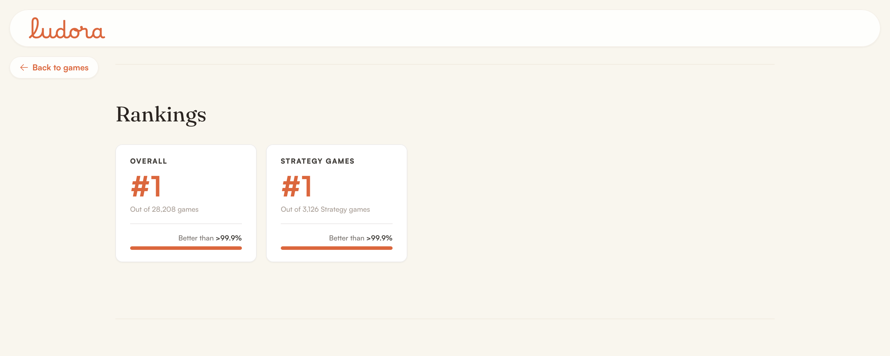

Overall and per-subdomain rank badges sit just below the distributions, reading the same `rank` and `subdomain_ranks` fields the hero stat tiles use.

## Ratings

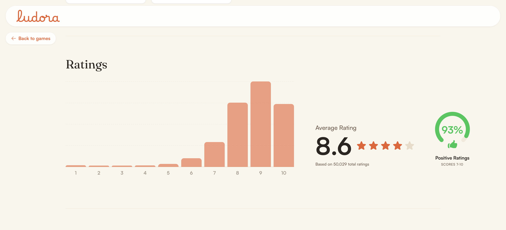

19 raw half-point buckets group into 10 visual bars. The arc gauge is the share of ratings at 7.0 or above. Real aggregation over the 26.2M-row `ratings` table, not a model.

## Reviews

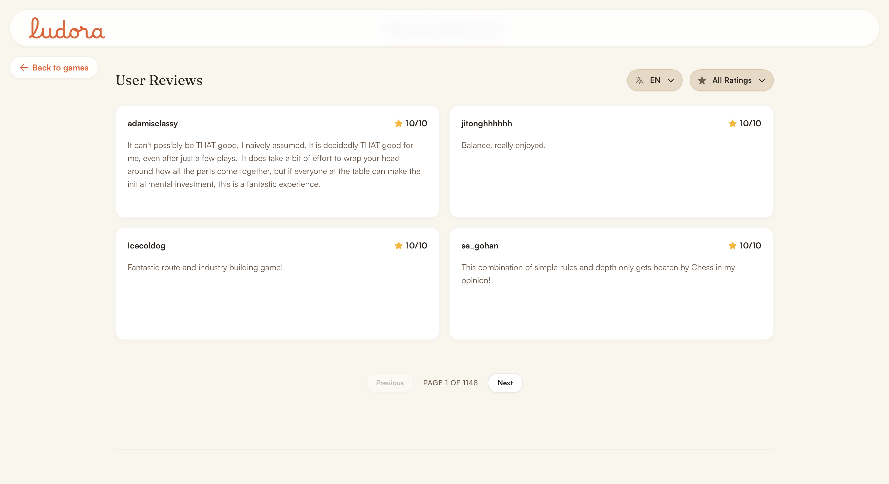

| Language filter | Rating-bucket filter |
|---|---|
| 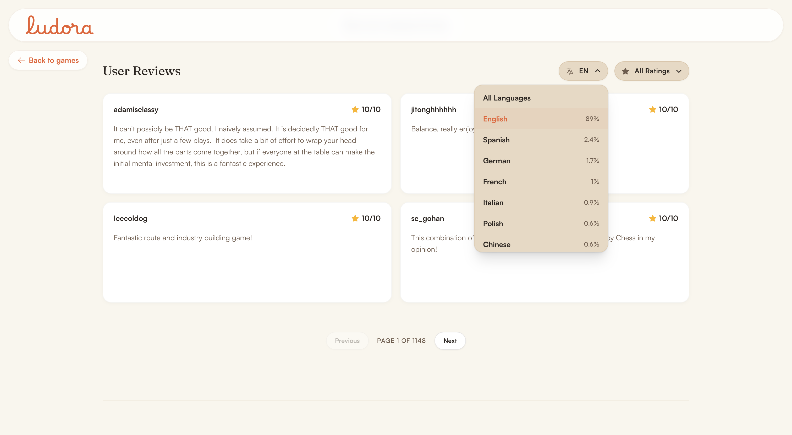 | 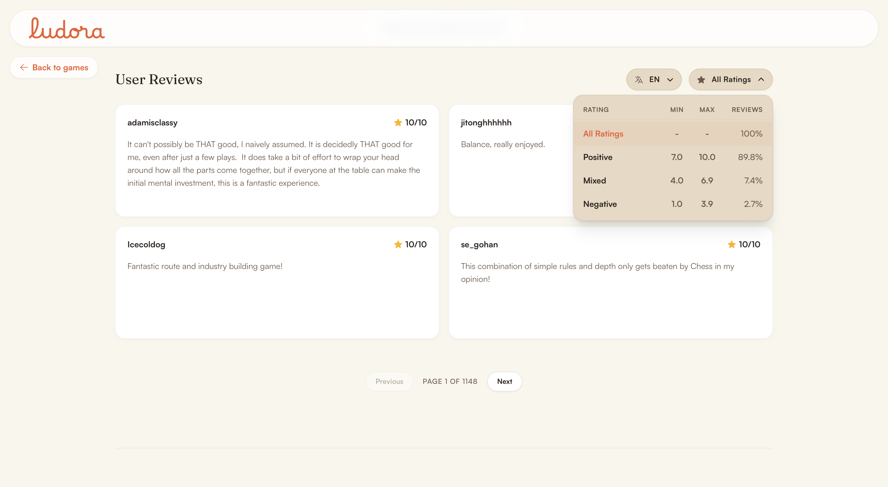 |

**Filtering happens server-side, not in the browser**, so paging is correct rather than filtering only the page you can see. The language list is built from the response's own breakdown rather than a hardcoded set. It therefore never offers a language this game has no reviews in. The `language` field is ML-derived, see [docs/ml/absa.md](../docs/ml/absa.md).

## AI Assistant

A drawer on every page. Responses render as inline cards rather than a chat transcript. Screenshots of every response type, and the design behind it, are in [docs/ml/assistant.md](../docs/ml/assistant.md).

## Recommendation engine

A tabbed model picker over 9 algorithms on the game detail page, described in [docs/ml/recommenders.md](../docs/ml/recommenders.md).

## Testing

There is none. No test framework is installed and there is no frontend CI. `npm run build` (strict `tsc -b`) and `npm run lint` (oxlint) are the only automated checks. See [docs/engineering/testing.md](../docs/engineering/testing.md).
