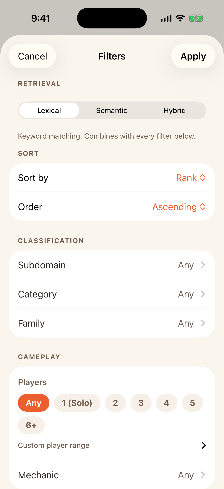
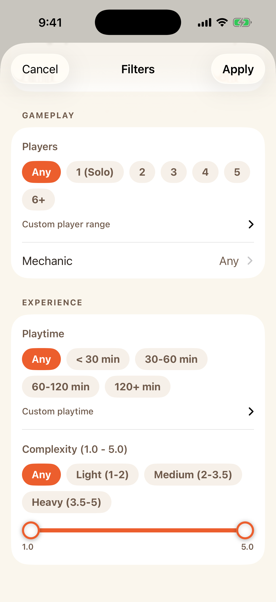
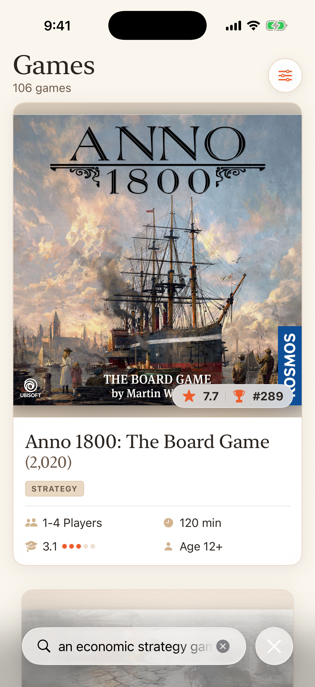
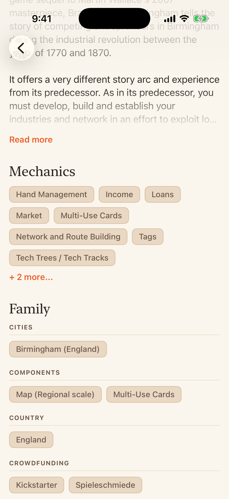
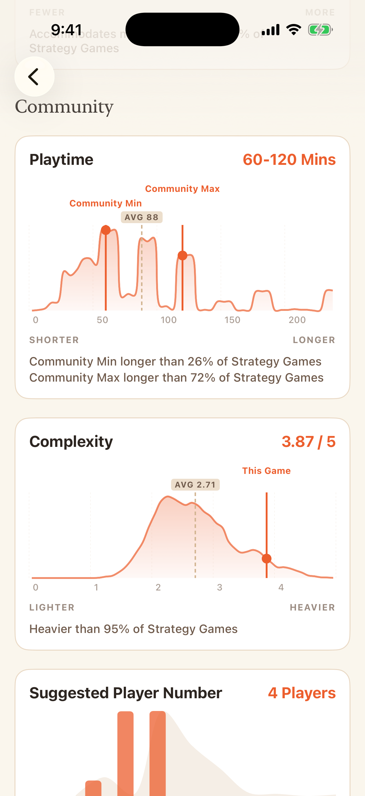
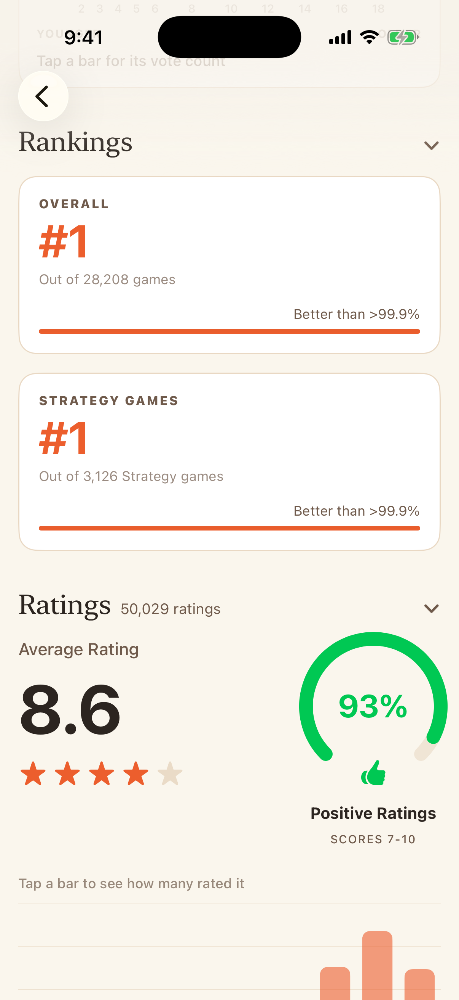
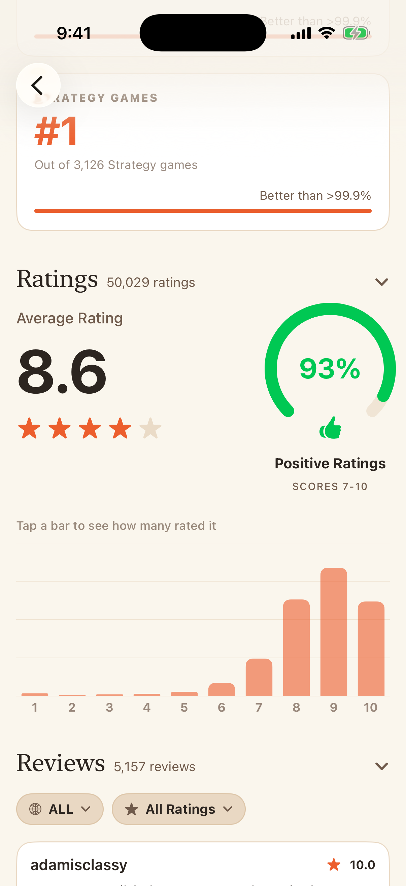
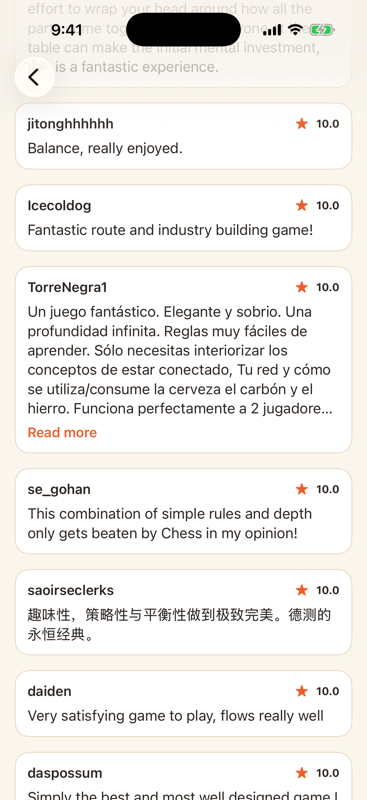
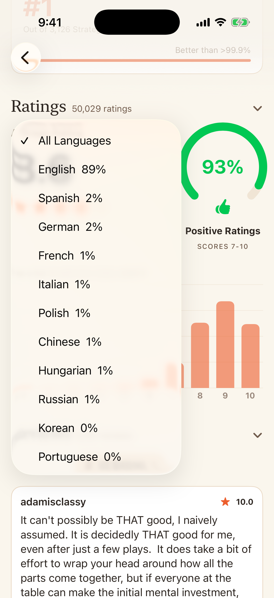
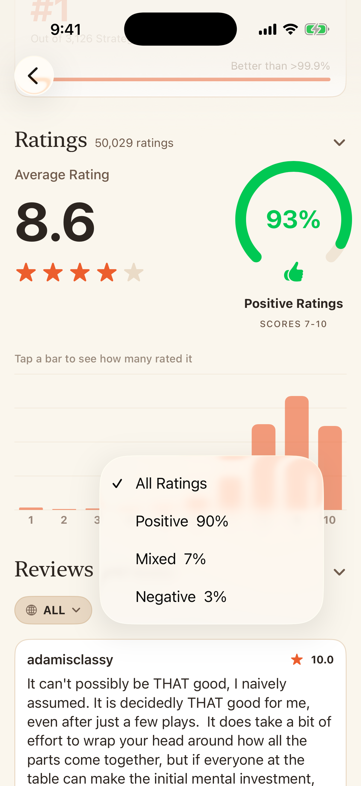

# Ludora for iOS

A native SwiftUI client for the Ludora catalog: browse, filter, sort, search, game detail, statistics, rankings, ratings, and reviews.

Swift 6, SwiftUI, iOS 17+, no third-party dependencies. The AI Assistant, Community Consensus, and the recommendation engine are deliberately not part of it. See [AGENTS.md](AGENTS.md) for why.

## What it looks like

Real captures against a running backend, mostly of **Brass: Birmingham**.

**Browse** puts one card per screen, swiped vertically, rather than porting the web grid.


**Filters** open in a sheet, grouped into Classification, Gameplay, and Experience, with retrieval mode and sort above them. **Search** runs the same three retrieval modes the web client does.

| Retrieval mode and classification | Gameplay and experience | Hybrid search |
|---|---|---|
|  |  |  |

**Game detail** opens with the cover, a Subdomain pill, Category pills, and six stat tiles. Mechanics, Family, and credits collapse past the first few values, and Family groups by namespace.

| Hero | Mechanics, family, credits |
|---|---|
|  |  |

**Statistics** draw the same density curves the [web client](../frontend/README.md#distribution-charts) does, split into Official and Community groups. The two suggested-player polls differ: they render as vote bars rather than a curve, because a poll is not a distribution.

| Official | Community | Rankings |
|---|---|---|
|  |  |  |

**Ratings** show a 10-bar histogram and an arc gauge for the share at 7.0 or above. **Reviews** paginate with a language filter and a rating-bucket filter, both server-side.

| Ratings | Reviews | Language filter | Rating filter |
|---|---|---|---|
|  |  |  |  |

## Getting it running

The app talks to the same backend the web frontend uses, so start that first:

```bash
make up        # Postgres
make backend   # FastAPI on :8000
```

Then, from the repo root:

```bash
make ios-test  # the package builds and tests with no Xcode at all
```

## Opening it in Xcode

The project already exists at `ios/Ludora/Ludora.xcodeproj`. Open it and press Run, with the backend up.

Two things about it are worth knowing, because both are easy to undo by accident.

**It uses a synchronized folder**. Xcode 16 projects can reference a directory rather than listing every file, so anything added under `ios/Ludora/Ludora/` joins the target automatically. There is no "drag the file into the project" step, and no `project.pbxproj` churn when a file is added or renamed.

**`LudoraKit` is wired in as a local package**, via an `XCLocalSwiftPackageReference` pointing at `../LudoraKit`. Xcode's own "Add Package Dependencies → Add Local" writes the same thing, so if the reference is ever lost, that menu item restores it.

### If you ever need to recreate the project

Xcode's App template creates a directory named after the product. A project called `Ludora` inside `ios/` therefore collides with the existing `ios/Ludora/`, and Xcode offers to **move the existing folder to Trash**. Do not accept, because that folder holds the app sources.

Move `ios/Ludora/` aside first, create the project, then move the sources back into `ios/Ludora/Ludora/`.

Two template defaults also need correcting afterwards:

- **Deployment target**. Xcode 26 defaults to iOS 26.2, which excludes nearly every real device. Set it to **iOS 17.0**, which is what `LudoraKit` targets.
- **"Create Git repository on my Mac."** Leave it unchecked. This is a monorepo, and a nested `.git` inside `ios/Ludora/` makes git treat the app as an embedded repository.

## Layout

```
LudoraKit/     Swift package: models, API client, decoding tests. No UI.
Ludora/        SwiftUI app: views, thin over LudoraKit.
```

Everything worth testing lives in `LudoraKit`, which builds and tests from the command line without Xcode or a simulator. See [AGENTS.md](AGENTS.md) for why, and for what this client deliberately leaves out.

## Fixtures

The decoding tests run against real API responses captured from a running backend, not hand-written JSON:

```bash
make ios-fixtures   # re-capture, needs the backend running
make ios-test       # fails with the field named if a shape changed
```

Refreshing fixtures is how a backend change surfaces here as a named test failure rather than a blank screen. Why that matters, and the two decoding rules that follow from it: [AGENTS.md](AGENTS.md#contract-drift-is-the-real-risk).
